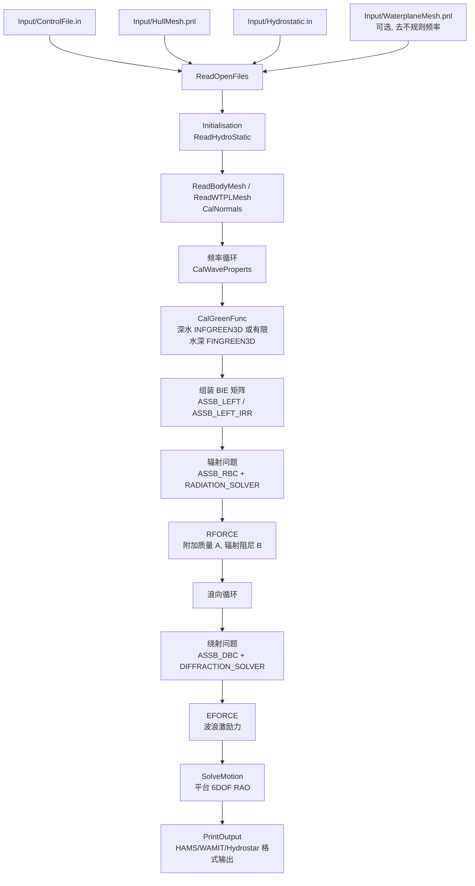

# HAMS 用于海上火箭回收浮式平台的研究笔记

日期：2026-07-30

工作目录：`E:\Projects\20260728-HAMS`

本文基于本项目中的 HAMS 源码、已编译运行的 `Cylinder` 和 `DeepCwind` 案例，以及 `HAMS_papers` 下的论文 PDF 和已转换 Markdown。用户提供的“全球海上无人平台回收运载火箭调研”作为应用场景边界：目标不是再做一个海上风机分析，而是把 HAMS 变成“海洋环境 - 浮式平台 - 火箭回收级”联合数字样机中的水动力内核。

## 1. 核心判断

HAMS 不是只面向海上风机的程序。它的名字是 Hydrodynamic Analysis of Marine Structures，本质是一个三维任意形状浮体/潜体的频域势流边界元求解器。海上风机只是它论文和自带算例里的典型对象。

对火箭海上回收平台，HAMS 最适合承担下面这些任务：

1. 给回收船、驳船、半潜平台、FPSO 型平台计算一阶波浪绕射力。
2. 给平台 6 自由度辐射附加质量和辐射阻尼。
3. 在给定质量、静水恢复、系泊/DP 等效线性刚度和阻尼后，计算平台 6 自由度 RAO。
4. 输出局部压力、自由面扰动、甲板目标点运动响应的基础数据。
5. 作为后续时域仿真、DP/GNC 联合仿真、蒙特卡洛海况筛选的频域预处理器。

HAMS 本身不能直接解决下面这些火箭回收特有问题：

1. DP 控制器和推力分配的非线性时域行为。
2. 火箭喷流 - 甲板 - 船体耦合热流、压力、声载荷。
3. 着陆腿接触、侧滑、反弹、缓冲器行程。
4. 钩索/网系捕获、柔性索网张力、异步挂索、断索。
5. 捕获后箭体与平台共同运动、自动固定、返港稳性变化。
6. 强非线性波浪、甲板上浪、绿水、粘性分离和大幅运动。

因此最佳路线是：保留 HAMS 的 Fortran 水动力内核，先用输入文件和后处理扩展到“浮式回收平台”，再逐步加入外部时域模块。不要一开始就把喷流、DP、接触、网系全塞进 HAMS 核心。

## 2. 文献脉络

| 文献 | 在 HAMS 体系中的作用 | 对火箭回收平台的价值 |
| --- | --- | --- |
| `01_Liu_2021_EWTEC_HAMS` | HAMS 简明介绍，说明软件面向任意三维浮体/潜体、混合源-偶极边界积分、最小二乘去不规则频率、LU 分解、OpenMP、输出波浪力/附加质量/阻尼/RAO/压力/自由面。见 `HAMS_papers/md/01_Liu_2021_EWTEC_HAMS.md:11`。 | 证明 DeepCwind 只是示例，理论对象可替换为回收驳船、船型平台或半潜平台。 |
| `02_Liu_2019_JMSE_HAMS` | HAMS 完整理论、数值实现和基准验证。明确它是频域预处理器，用于输出波浪激励力、附加质量和辐射阻尼，也能求运动响应。见 `HAMS_papers/md/02_Liu_2019_JMSE_HAMS.md:13`。 | 适合做平台海况快速筛选和 RAO 数据库。 |
| `03_Liu_2016_JMST_panel_stick` | 面板法和 Morison stick 混合模型。大尺度构件用势流面元，细长杆件和粘性阻尼用 Morison。见 `HAMS_papers/md/03_Liu_2016_JMST_panel_stick.md:29` 和 `:35`。 | 回收平台可能有捕获架、支撑杆、网架、甲板附属结构。水下粗大浮体进 HAMS，细杆/粘性项外接 Morison 模型更合理。 |
| `04_Liang_2018_AOR_validation` | 验证深水 Green 函数全局近似对半球和 FPSO 的线性载荷、RAO、平均漂移力有效。见 `HAMS_papers/md/04_Liang_2018_AOR_validation.md:17` 和 FPSO RAO 部分 `:264`。 | FPSO/船型平台和火箭回收驳船比风机更接近，说明 HAMS 的深水 Green 函数路线可用于船舶浮体。 |
| `05_Wu_2018_AOR_wave_component` | 深水 Green 函数波动分量和导数的高效计算。 | 支撑 HAMS 深水快速频扫。 |
| `06_Wu_2017_EJMB_global_approx` | 深水 Green 函数分解为自由空间奇异项、局部非振荡流、波动项，并给全局近似。见 `HAMS_papers/md/06_Wu_2017_EJMB_global_approx.md:35` 和 `:41`。 | 深水海上回收平台的高效面元求解基础。 |
| `06b_Wu_2017_MARINE_conference_related` | 06 的会议相关稿，同样强调 offshore structure 或低速船舶深水绕射/辐射。见 `HAMS_papers/md/06b_Wu_2017_MARINE_conference_related.md:9`。 | 补充说明低速船舶也在适用对象内。 |
| `07_Liu_2018_ECM_FinGreen3D` | 有限水深 Green 函数库 FinGreen3D 的接口、四区域算法、色散根求解。见 `HAMS_papers/md/07_Liu_2018_ECM_FinGreen3D.md:235` 和 `:243`。 | 若回收海域在近海、中等水深，不能简单用深水假设。 |
| `08_Liu_2015_IJNAOE_GreenFunction` | 有限水深 Green 函数算法源头，按 `R/h` 划分四个区域，并用 epsilon 加速。见 `HAMS_papers/md/08_Liu_2015_IJNAOE_GreenFunction.md:7`、`:109`、`:141`、`:157`、`:211`。 | 可支持浅水/中等水深回收海域的平台运动分析。 |

## 3. HAMS 的计算逻辑

HAMS 主程序是 `SourceCode/HAMS_Prog.f90`，核心调用顺序如下：



源码锚点：

| 步骤 | 文件和位置 | 说明 |
| --- | --- | --- |
| 读输入 | `SourceCode/InputFiles.f90:28`、`:37` - `:40` | 打开 `ControlFile.in`、`HullMesh.pnl`、`Hydrostatic.in`、`ErrorCheck.txt`。 |
| 可选水线面 | `SourceCode/InputFiles.f90:105` - `:109` | `ISOL` 控制绕射解法，`IRSP` 控制是否读 `WaterplaneMesh.pnl` 去不规则频率。 |
| 频率转换 | `SourceCode/ImplementSubs.f90:40` - `:151` | 支持以无量纲频率、波数、角频率、周期、波长输入，有限水深时解色散关系。 |
| 网格和法向 | `SourceCode/ReadPanelMesh.f90:46` - `:65`、`:120` - `:140` | 读取湿表面和水线内域面元，计算面心、面积、法向、广义法向。 |
| Green 函数 | `SourceCode/CalGreenFunc.f90:49` - `:118` | 计算普通 BIE 的 Rankine 奇异项和自由面 Green 项。 |
| 去不规则频率 | `SourceCode/CalGreenFunc.f90:124` - `:252` | 额外对内部水线面计算影响系数。 |
| BIE 矩阵 | `SourceCode/AssbMatx.f90:51` - `:113` | 组装左端矩阵并 LU 分解。 |
| 辐射求解 | `SourceCode/AssbMatx.f90:120` - `:180`、`:274` - `:318` | 六个刚体运动方向的辐射势求解。 |
| 绕射求解 | `SourceCode/AssbMatx.f90:186` - `:268`、`:324` - `:369` | 给定浪向求入射/绕射问题。 |
| 最小二乘去不规则频率 | `SourceCode/AssbMatx_irr.f90:52` - `:180`、`:188` - `:324`、`:332` - `:504` | 先构造扩展方程，再形成正规方程。 |
| 水动力系数 | `SourceCode/PotentWavForce.f90:44` - `:131`、`:136` - `:221` | 积分得到激励力、附加质量和辐射阻尼。 |
| 运动方程 | `SourceCode/SolveMotion.f90:27` - `:115` | 求 6DOF 复数位移 RAO，包含外部线性阻尼、二次阻尼和外部刚度。 |
| 输出 | `SourceCode/PrintOutput.f90:43` - `:134`、`:140` - `:191` | 输出 AddedMass、WaveDamping、Excitation、Motion 的 Hydrostar/HAMS/WAMIT 格式。 |

## 4. 关键公式

### 4.1 频域势流假设

HAMS 使用线性势流，假设流体不可压、无粘、无旋，时间因子为：

```math
\Phi(\mathbf{x},t)=\Re\{\phi(\mathbf{x})e^{-i\omega t}\}
```

总势函数可分解为：

```math
\phi
=\phi_0+\phi_7-i\omega\sum_{j=1}^{6}\xi_j\phi_j
```

其中：

| 量 | 含义 |
| --- | --- |
| `phi_0` | 入射波势 |
| `phi_7` | 绕射势 |
| `phi_j, j=1..6` | 六个刚体自由度的辐射势 |
| `xi_j` | 平台六自由度复数运动幅值 |

这套形式来自 `03_Liu_2016_JMST_panel_stick.md:74` - `:117`，也是 HAMS 核心方程的基础。

### 4.2 边界积分方程

对散射势，在湿表面 `S_B` 上采用混合源-偶极边界积分：

```math
2\pi\phi_j(\mathbf{x})
+\int_{S_B}\phi_j(\boldsymbol{\xi})
{\partial G(\boldsymbol{\xi};\mathbf{x})\over \partial n_\xi}\,dS_\xi
=
\int_{S_B}V_{n,j}(\boldsymbol{\xi})G(\boldsymbol{\xi};\mathbf{x})\,dS_\xi
```

其中 `j=1..6` 为辐射问题，`j=7` 为绕射问题。HAMS 论文中还给了一个直接绕射方程：

```math
2\pi\phi_S(\mathbf{x})
+\int_{S_B}\phi_S(\boldsymbol{\xi})
{\partial G(\boldsymbol{\xi};\mathbf{x})\over \partial n_\xi}\,dS_\xi
=4\pi\phi_I(\mathbf{x})
```

代码对应：

| 公式环节 | 代码 |
| --- | --- |
| Green 影响系数 | `SourceCode/CalGreenFunc.f90:49` - `:118` |
| 左端矩阵 | `SourceCode/AssbMatx.f90:51` - `:113` |
| 辐射右端 | `SourceCode/AssbMatx.f90:120` - `:180` |
| 绕射右端 | `SourceCode/AssbMatx.f90:186` - `:268` |
| LU 求解 | `SourceCode/AssbMatx.f90:108`、`:292`、`:344` |

### 4.3 面元影响系数

离散后，每个源面元 `j` 对控制点 `i` 的影响可写为：

```math
S_{ij}=\int_{S_j}G(\boldsymbol{\xi};\mathbf{x}_i)dS_\xi
```

```math
D_{ij}=\int_{S_j}{\partial G(\boldsymbol{\xi};\mathbf{x}_i)\over \partial n_\xi}dS_\xi
```

HAMS 对近场奇异 Rankine 项采用解析面元积分，对自由面 Green 项采用数值/近似算法。源码中普通面元和水线面元分别存入：

| 数组 | 来源 | 含义 |
| --- | --- | --- |
| `RKBN` | `SourceCode/CalGreenFunc.f90:104` - `:107` | 湿表面 Rankine 奇异项及导数 |
| `CGRN` | `SourceCode/CalGreenFunc.f90:108` | 湿表面自由面 Green 函数及导数 |
| `PKBN` | `SourceCode/CalGreenFunc.f90:239` - `:242` | 内部水线面 Rankine 项 |
| `DGRN` | `SourceCode/CalGreenFunc.f90:243` | 内部水线面自由面 Green 项 |

### 4.4 深水和有限水深 Green 函数

深水 Green 函数可理解为：

```math
G
=
{1\over r}+{1\over r_1}
+2\nu\int_0^\infty
{e^{\mu(z+\zeta)}\over \mu-\nu}
J_0(\mu R)d\mu
```

有限水深 Green 函数可理解为：

```math
G
=
{1\over r}+{1\over r_2}
+2\int_0^\infty
{(\mu+\nu)\cosh\mu(z+h)\cosh\mu(\zeta+h)
\over
\mu\sinh\mu h-\nu\cosh\mu h}
e^{-\mu h}J_0(\mu R)d\mu
```

其中：

```math
\nu={\omega^2\over g}
```

源码选择逻辑在 `SourceCode/CalGreenFunc.f90:99` - `:101` 和 `:174` - `:176`：

| 水深输入 | 使用函数 |
| --- | --- |
| `H < 0` | `INFGREEN3D`，深水 |
| `H > 0` | `FINGREEN3D`，有限水深 |

`FinGreen3D` 论文把有限水深算法按 `R/h` 分成四个区间：

| 区域 | 条件 | 方法 |
| --- | --- | --- |
| A | `R/h >= 0.5` | John 特征函数展开 |
| B | `0.05 <= R/h < 0.5` | 特征函数展开 + epsilon 加速 |
| C | `0.0005 <= R/h < 0.05` | 改进 Pidcock 展开 + epsilon 加速 |
| D | `R/h < 0.0005` | Linton/Ewald 快速收敛表示 |

这部分对应 `08_Liu_2015_IJNAOE_GreenFunction.md:109`、`:141`、`:157`、`:211`，以及 `07_Liu_2018_ECM_FinGreen3D.md:235` - `:259`。

### 4.5 去不规则频率

表面穿透浮体会出现不规则频率，数值上表现为附加质量、阻尼或激励力附近出现尖跳。HAMS 采用部分扩展边界积分方程，在内部水线面上假设势函数为零，并用最小二乘形成正规方程：

```math
\mathbf{A}_{(M+N)\times N}\boldsymbol{\phi}
=\mathbf{b}_{(M+N)}
```

```math
\min_{\boldsymbol{\phi}}\|\mathbf{A}\boldsymbol{\phi}-\mathbf{b}\|_2^2
```

```math
\mathbf{A}^{H}\mathbf{A}\boldsymbol{\phi}
=
\mathbf{A}^{H}\mathbf{b}
```

代码里直接对应 `ASSB_LEFT_IRR` 形成 `CMAT`，`ASSB_RBC_IRR` 形成 `DRMAT`，`ASSB_DBC_IRR` 形成 `DDMAT`：

| 数组 | 代码位置 | 含义 |
| --- | --- | --- |
| `AMAT(TNELEM,TNELEM,NSYS)` | `SourceCode/AssbMatx_irr.f90:52` - `:57` | 扩展后的方程矩阵 |
| `CMAT(NELEM,NELEM,NSYS)` | `SourceCode/AssbMatx_irr.f90:154` - `:175` | 正规方程左端 |
| `DRMAT` | `SourceCode/AssbMatx_irr.f90:304` - `:314` | 辐射右端正规化 |
| `DDMAT` | `SourceCode/AssbMatx_irr.f90:486` - `:495` | 绕射右端正规化 |

工程建议：对火箭回收平台这类表面穿透船体/驳船，默认 `IRSP=1`，并提供 `WaterplaneMesh.pnl`。

### 4.6 水动力系数和波浪激励

波浪激励力：

```math
F_{{Exc},i}
=
i\omega\rho\int_{S_B}(\phi_0+\phi_7)n_i\,dS
```

附加质量：

```math
A_{ij}
=
\Re\left[
i\rho\int_{S_B}\phi_j n_i\,dS
\right]
```

辐射阻尼：

```math
B_{ij}
=
\Im\left[
i\omega\rho\int_{S_B}\phi_j n_i\,dS
\right]
```

代码对应：

| 输出 | 代码 |
| --- | --- |
| 激励力 `EXFC` | `SourceCode/PotentWavForce.f90:44` - `:131` |
| 附加质量 `AMAS` | `SourceCode/PotentWavForce.f90:136` - `:221` |
| 辐射阻尼 `BDMP` | `SourceCode/PotentWavForce.f90:136` - `:221` |

### 4.7 平台运动方程

HAMS 的 6 自由度频域运动方程为：

```math
\sum_{j=1}^{6}
\left[
-\omega^2(M_{ij}+A_{ij})
-i\omega(B_{ij}+B^E_{ij})
+(C_{ij}+C^E_{ij})
\right]\xi_j
=
F_{{Exc},i}
```

代码中是：

```fortran
LEFT=-W1**2*(MATX+AMAS)-CI*W1*(BDMP+BLNR)+CRS+KSTF
```

位置：`SourceCode/SolveMotion.f90:54`。

矩阵映射：

| HAMS 变量 | 输入/来源 | 工程含义 |
| --- | --- | --- |
| `MATX` | `Input/Hydrostatic.in` | 平台质量和惯性矩阵 |
| `AMAS` | HAMS 辐射求解 | 频率相关附加质量 |
| `BDMP` | HAMS 辐射求解 | 频率相关波浪辐射阻尼 |
| `BLNR` | `Input/Hydrostatic.in` | 外部线性阻尼，可放等效 DP/系泊/粘性阻尼 |
| `BQDR` | `Input/Hydrostatic.in` | 外部二次阻尼，代码中迭代等效线性化 |
| `CRS` | `Input/Hydrostatic.in` | 静水恢复矩阵 |
| `KSTF` | `Input/Hydrostatic.in` | 外部刚度，可放线性化系泊或 DP 等效刚度 |
| `EXFC` | HAMS 绕射求解 | 一阶波浪激励力 |
| `DSPL` | `SolveMotion` 输出 | 平台 6 自由度复数 RAO |

HAMS 已经预留了外部线性阻尼、二次阻尼、外部刚度入口，见 `SourceCode/HydroStatic.f90:73` - `:98`。

### 4.8 广义法向和力矩臂

平动法向是普通面元法向：

```math
(n_1,n_2,n_3)=\mathbf{n}
```

转动广义法向由参考点 `XR` 到面心的力臂给出：

```math
n_4=(y-Y_R)n_3-(z-Z_R)n_2
```

```math
n_5=(z-Z_R)n_1-(x-X_R)n_3
```

```math
n_6=(x-X_R)n_2-(y-Y_R)n_1
```

代码位置：`SourceCode/NormalProcess.f90:46` - `:64`，调用位置 `SourceCode/ReadPanelMesh.f90:126` - `:128`。

对火箭回收平台很重要的一点：`XR` 是 HAMS 求力矩和转动的参考点。若后续要算甲板某个着陆点的运动，不能只看 `DSPL(1..6)`，必须把 `XR` 点的六自由度运动转到甲板目标点。

## 5. 迁移到火箭回收平台的建模框架

### 5.1 HAMS 在联合仿真中的位置

用户给的调研已经把问题本质说得很清楚：DP 不能把甲板变成惯性静止平台，真正约束火箭末端制导的是未来几秒的甲板目标点位置、速度、姿态、角速度和预测误差。

建议把总系统写成：

```math
(\mathbf{M}+\mathbf{A}(\omega))\ddot{\boldsymbol{\eta}}
+\mathbf{B}(\omega)\dot{\boldsymbol{\eta}}
+(\mathbf{C}+\mathbf{K}_{ext})\boldsymbol{\eta}
=
\mathbf{F}_{wave}
+\boldsymbol{\tau}_{DP}
+\mathbf{F}_{wind}
+\mathbf{F}_{current}
+\mathbf{F}_{plume}
+\mathbf{F}_{contact/net}
```

HAMS 负责：

```math
\mathbf{A}(\omega),\quad
\mathbf{B}(\omega),\quad
\mathbf{F}_{wave}(\omega,\beta),\quad
\boldsymbol{\eta}_{RAO}(\omega,\beta)
```

外部模块负责：

```math
\boldsymbol{\tau}_{DP},\quad
\mathbf{F}_{wind},\quad
\mathbf{F}_{current},\quad
\mathbf{F}_{plume},\quad
\mathbf{F}_{contact/net}
```

### 5.2 甲板目标点运动

火箭不是落在平台参考点 `XR`，而是落在或捕获于甲板上的目标点。设目标点在船体坐标系的位置为：

```math
\mathbf{r}_d^S=[x_d,y_d,z_d]^T
```

小角度频域下，目标点位移可由平台 6DOF RAO 线性变换：

```math
\delta\mathbf{r}_d
=
\begin{bmatrix}\xi_1\\\xi_2\\\xi_3\end{bmatrix}
+
\begin{bmatrix}\xi_4\\\xi_5\\\xi_6\end{bmatrix}
\times
\mathbf{r}_d^S
```

展开为：

```math
\delta x_d=\xi_1+\xi_5 z_d-\xi_6 y_d
```

```math
\delta y_d=\xi_2+\xi_6 x_d-\xi_4 z_d
```

```math
\delta z_d=\xi_3+\xi_4 y_d-\xi_5 x_d
```

甲板目标点速度 RAO：

```math
\dot{\delta\mathbf{r}}_d=i\omega\delta\mathbf{r}_d
```

角速度 RAO：

```math
\boldsymbol{\omega}_S=i\omega[\xi_4,\xi_5,\xi_6]^T
```

实际制导要用相对速度：

```math
\mathbf{v}_{rel}
=
\mathbf{v}_R^I
-
\left[
\mathbf{v}_S^I+
\boldsymbol{\omega}_S^I
\times
(\mathbf{R}_S^I\mathbf{r}_d^S)
\right]
```

其中旋转项在大甲板上不能忽略。比如着陆点离参考点几十米，1 deg/s 的横摇/纵摇角速度就会产生可观的局部垂向或横向速度。

### 5.3 规则波到不规则海况

HAMS 输出的是规则波频率和浪向下的 RAO。要得到真实海况指标，需要把 RAO 和方向波谱结合：

```math
S_{y}(\omega,\beta)
=
|H_y(\omega,\beta)|^2 S_{\zeta}(\omega,\beta)
```

响应方差：

```math
\sigma_y^2
=
\int_{\beta}\int_{\omega}
S_y(\omega,\beta)d\omega d\beta
```

速度方差：

```math
\sigma_{\dot{y}}^2
=
\int_{\beta}\int_{\omega}
\omega^2 |H_y(\omega,\beta)|^2 S_{\zeta}(\omega,\beta)d\omega d\beta
```

回收窗口不要只写“几级海况”，应至少输出：

1. 甲板目标点水平位移、垂向位移、速度和加速度 RMS。
2. 垂向速度最大可能值或给定超越概率值。
3. 甲板倾角和角速度。
4. 不同浪向下的最差响应。
5. DP 余量和允许艏向优化范围。
6. 火箭末端制导可接受的相对位置/速度/姿态包络。

### 5.4 火箭回收平台的三种水动力模型层级

| 层级 | 用途 | HAMS 如何使用 | 不足 |
| --- | --- | --- | --- |
| Level 1: 线性平台 RAO | 早期船型/驳船/半潜方案筛选 | 直接用 HAMS 求 `A/B/EXFC/DSPL`，后处理甲板点响应 | 无 DP、喷流、接触和非线性 |
| Level 2: 等效 DP/系泊/阻尼 | 回收窗口海况筛选 | 在 `Hydrostatic.in` 的 `BLNR/BQDR/KSTF` 加入线性化外部项 | DP 动态和推力饱和只能近似 |
| Level 3: 时域联合仿真 | 末端制导、着陆/捕获、安全性 | 用 HAMS 输出频域数据，转换成时域辐射记忆核或状态空间，再耦合 GNC/DP/接触/索网 | 需要新增外部求解器，不应只靠 HAMS |

## 6. 面向火箭回收的实施路线

### 6.1 阶段 A：不改核心，建立回收平台工况

1. 新建 `RocketRecoveryCases/<case>/Input`，保持 HAMS 既有目录结构。
2. 生成平台湿表面面元 `HullMesh.pnl`：
   - 动力定位驳船/回收船：船体、浮箱、舭部、艉部、月池或开口结构。
   - 半潜平台：立柱、下浮体、连接桥下部等大尺度浸没构件。
   - 网系平台：只把真正浸水的大尺度浮体放入湿表面；高耸捕获架不放入 HAMS 湿表面。
3. 生成 `WaterplaneMesh.pnl`，默认开启 `IRSP=1`。
4. 填写 `Hydrostatic.in`：
   - 回收前空平台状态。
   - 火箭接触/捕获瞬间的等效状态。
   - 火箭固定后返港状态。
5. 用已有 `local-tools/Run-HAMS.ps1` 运行频率和浪向扫描。
6. 用 Python/HTML 后处理输出：
   - 平台 6DOF RAO。
   - 着陆点位移、速度、倾角、角速度 RAO。
   - 给定海况下的 RMS 和超越概率。
   - 可视化三维湿表面和甲板目标点。

这一阶段已经能回答“某个回收平台在某个海况下甲板动得多厉害”。

### 6.2 阶段 B：加入回收场景专用后处理

建议新增脚本：

```text
analysis/rocket_recovery/
  deck_point_rao.py
  sea_state_response.py
  recovery_window_report.py
  platform_state_compare.py
```

功能：

| 脚本 | 输入 | 输出 |
| --- | --- | --- |
| `deck_point_rao.py` | `Output/Hydrostar_format/Motion_*.rao`，目标点坐标 | 目标点 3D 位移、速度、倾角、角速度 RAO |
| `sea_state_response.py` | 目标点 RAO，`Hs/Tp/gamma/beta` 方向谱 | RMS、最大可能响应、超越概率 |
| `recovery_window_report.py` | 海况库，火箭允许包络 | HTML 回收窗口报告 |
| `platform_state_compare.py` | 空载/着陆后/固定后三组 HAMS 结果 | 质量和重心变化对 RAO 的影响 |

这一步不用改 Fortran，风险最低，收益最大。

### 6.3 阶段 C：引入外部动力学

DP、喷流、接触、索网应作为外部模块进入总方程：

```math
\mathbf{M}_{eff}\ddot{\boldsymbol{\eta}}
=
\mathbf{F}_{hydro}
+\boldsymbol{\tau}_{DP}
+\mathbf{F}_{plume}
+\mathbf{F}_{landing}
+\mathbf{F}_{net}
+\mathbf{F}_{wind/current}
```

建议顺序：

1. DP 先用线性等效刚度/阻尼放进 `KSTF/BLNR`。
2. DP 再扩展为低频时域控制器，平台波频运动仍由 RAO/谱法提供。
3. 喷流先用降阶压力分布或总力/力矩时程，而不是直接 CFD 耦合。
4. 着陆腿先做垂向弹簧阻尼 + 摩擦锥 + 接触开闭。
5. 网系捕获先做多体质量点 - 索段 - 阻尼器模型，再考虑高保真柔性索网。
6. 最后把火箭 GNC 加入，做相对甲板预测制导。

### 6.4 阶段 D：必要时改 Fortran 核心

只有在下面情况出现时，才建议改 HAMS 核心：

1. 需要把 HAMS 作为 DLL/库反复调用，而不是文件式批处理。
2. 需要输出某些内部势函数、面元压力、波场速度给外部 Morison/喷流/控制模块。
3. 需要支持新的输出格式，例如直接写 JSON/CSV 给网页可视化。
4. 需要把甲板目标点 RAO 写入 HAMS 原生输出，而不是 Python 后处理。
5. 需要做多体浮体水动力耦合。

现阶段不建议改动 Green 函数、BIE 求解、LU 求解这些核心数值模块。

## 7. 输入文件如何映射到回收平台

### 7.1 `ControlFile.in`

关键字段：

| 字段 | 代码读取位置 | 火箭回收平台建议 |
| --- | --- | --- |
| `Water depth` | `SourceCode/InputFiles.f90:52` | 远海可深水 `H < 0`；近海回收用实测水深 `H > 0`。 |
| `Input frequency type` | `SourceCode/InputFiles.f90:56` | 推荐用角频率或周期，便于和波谱对接。 |
| `Output frequency type` | `SourceCode/InputFiles.f90:57` | 推荐角频率，后处理最直接。 |
| `Number of wave headings` | `SourceCode/InputFiles.f90:85` | 至少扫 0、30、60、90、120、150、180 deg。 |
| `Reference body center` | `SourceCode/InputFiles.f90:101` | 建议设为平台质心或水动力参考点，并在后处理记录着陆点相对坐标。 |
| `Reference length` | `SourceCode/InputFiles.f90:104` | 用平台主尺度，船型可用长度或宽度，需统一归一化解释。 |
| `Wave diffrac solution` | `SourceCode/InputFiles.f90:105` | 可优先用 `ISOL=2` 的直接绕射方程。 |
| `Remove irr freq` | `SourceCode/InputFiles.f90:106` | 表面穿透浮体推荐 `IRSP=1`。 |
| `NTHREAD` | `SourceCode/InputFiles.f90:107` | 本机已可编译 OpenMP，按 CPU 核数设置。 |

### 7.2 `Hydrostatic.in`

`ReadHydroStatic` 读取：

```text
XG
MATX(6,6)
BLNR(6,6)
BQDR(6,6)
CRS(6,6)
KSTF(6,6)
```

位置：`SourceCode/HydroStatic.f90:73` - `:98`。

火箭回收平台建议准备三套：

| 状态 | 质量/刚度变化 | 用途 |
| --- | --- | --- |
| `pre_landing` | 只有平台、DP、甲板设备、捕获结构 | 评估火箭到达前甲板运动 |
| `touchdown_or_capture` | 可加入短时等效接触/捕获刚度和阻尼 | 初步筛选危险响应，不替代真实接触仿真 |
| `secured_return` | 加入火箭质量、重心、惯性矩、风载面积变化 | 评估着陆后固定、返港窗口 |

注意：HAMS 的 `MATX` 是刚体质量矩阵，火箭固定后应重新计算整体质量、重心和惯性，而不是简单在垂向质量上加一个数字。

### 7.3 `HullMesh.pnl`

`ReadBodyMesh` 读取节点和三/四边形面元，位置 `SourceCode/ReadPanelMesh.f90:46` - `:65`。

建议：

1. 面元只包含湿表面。
2. 面元法向和节点顺序要符合 HAMS 约定，否则附加质量和激励力会出错。
3. 对表面穿透体，水线附近要有足够网格质量，并配套 `WaterplaneMesh.pnl`。
4. 甲板、火箭、网架一般不作为湿表面进入 HAMS，除非其结构浸水或会改变水线。
5. 如果是船型/FPSO/驳船，优先从 CAD/mesh 工具转换为 HAMS `.pnl`，不要手工拼复杂船体。

### 7.4 `WaterplaneMesh.pnl`

`ReadWTPLMesh` 要求内部水线面元在 `z=0`，位置 `SourceCode/ReadPanelMesh.f90:74` - `:99`。对火箭回收平台，这个文件非常关键，因为船体、驳船和半潜立柱都可能穿过自由面。

## 8. 火箭回收场景的推荐指标

HAMS 原生输出平台 6DOF RAO，但火箭关心的是甲板目标点和捕获接口。建议把结果组织成下面指标：

| 指标 | 由什么计算 | 意义 |
| --- | --- | --- |
| `deck_x/y/z_RAO` | 6DOF RAO + 目标点坐标 | 火箭末端相对导航目标运动 |
| `deck_vx/vy/vz_RAO` | `i*omega*deck_RAO` | 触地/捕获相对速度约束 |
| `roll/pitch/yaw_RAO` | HAMS Motion 4/5/6 | 甲板倾角约束 |
| `roll_rate/pitch_rate/yaw_rate` | `i*omega*angular_RAO` | 支腿接触时序和网系挂索动态 |
| `RMS` | RAO + 波谱积分 | 给定海况平均强度 |
| `MPM/极值` | 响应谱 + 作业时长 | 回收窗口安全裕度 |
| `heading_sensitivity` | 多浪向扫描 | 决定 DP 艏向策略 |
| `pre/secured comparison` | 不同 `Hydrostatic.in` | 着陆后返港风险 |

## 9. 两条回收路线如何接入 HAMS

### 9.1 着陆腿落甲板

HAMS 用途：

1. 提供甲板点垂向速度、横向速度、倾角、角速度。
2. 评估平台偏心着陆点的局部运动放大。
3. 评估空平台和火箭固定后平台 RAO 变化。
4. 给接触动力学提供波频平台运动边界条件。

外部模型：

```math
F_z=k_l\delta+c_l\dot{\delta}
```

```math
|F_t|\le \mu F_z
```

还需要接触开闭、支腿异步接触、缓冲行程、发动机关机时序、反弹和侧滑。

### 9.2 钩索/网系捕获

HAMS 用途：

1. 计算平台和高耸捕获架底座的波浪运动输入。
2. 计算捕获前平台目标点运动预测。
3. 评估捕获后平台质量/重心变化对稳性的影响。

外部模型：

```math
E_{rel}
\rightarrow
\sum_i\int T_i\,d\ell_i
+E_{damper}
+E_{structural}
+E_{residual\ swing}
```

还需要索段松弛/张紧切换、钩索接触、非对称张力、箭体摆振、高耸桁架弹性、捕获后锁紧。

HAMS 不能替代柔性索网动力学，但可以提供海况下捕获架底座运动和平台整体水动力。

## 10. 代码改造建议

### 10.1 先做的

1. 增加 `RocketRecoveryCases` 案例目录，保持 HAMS 输入结构。
2. 增加 `analysis/rocket_recovery/deck_point_rao.py`，读取现有 Motion RAO 并输出甲板点运动。
3. 增加 `analysis/rocket_recovery/sea_state_response.py`，把规则波 RAO 变成不规则海况统计。
4. 增加 HTML 报告，将 3D 平台、着陆点、RAO 曲线、海况指标放在一页。
5. 为每个案例保存 `platform_config.json`，记录：
   - 平台类型。
   - 参考点 `XR`。
   - 质心 `XG`。
   - 着陆/捕获点坐标。
   - 火箭质量状态。
   - DP/系泊等效参数。

### 10.2 后做的

1. 从 HAMS 输出中提取面元压力和自由面，给喷流/甲板环境可视化留接口。
2. 支持多平台状态批量运行：`pre_landing`、`touchdown_or_capture`、`secured_return`。
3. 把 HAMS 频域结果转换为时域 Cummins 方程所需的辐射记忆核。
4. 增加 DP/GNC/接触/网系外部联合仿真。
5. 若需要实时或大规模参数扫描，再考虑 DLL/API 化。

### 10.3 暂时不建议做的

1. 不要改 Green 函数算法。
2. 不要把 DP 控制器直接写进 `SolveMotion.f90`。
3. 不要把火箭喷流 CFD 简化为 HAMS 内部面元项。
4. 不要把柔性网系捕获塞进频域线性 RAO 模型。
5. 不要只用平台质心 RAO 判断回收可行性，必须算甲板点响应。

## 11. 第一组可执行研究案例

### Case R0：DeepCwind 作为半潜回收平台替身

目的：先不造新船体，用已跑通的 DeepCwind 验证后处理链。

操作：

1. 使用 `CertTest/DeepCwind` 的 HAMS 输出。
2. 假设一个甲板/捕获点，例如 `r_d=[0,0,20] m` 或位于外侧立柱附近。
3. 从 `Output/Hydrostar_format/Motion_*.rao` 读入六自由度 RAO。
4. 计算甲板点 `x/y/z` 位移和速度 RAO。
5. 用 JONSWAP/PM 谱生成 `Hs=1,2,3 m`、`Tp=6,8,10 s` 的响应统计。
6. 输出 HTML 图表。

意义：最快形成“平台 RAO -> 甲板运动 -> 火箭约束”的闭环。

### Case R1：矩形动力定位驳船

目的：更接近 SpaceX/Blue/Rocket Lab 类型的无人回收平台。

建议几何：

```text
Length  : 90 - 150 m
Beam    : 30 - 60 m
Draft   : 5 - 10 m
Depth   : according to sea area
Deck target: center or slightly aft
```

操作：

1. 生成矩形驳船湿表面 `HullMesh.pnl`。
2. 生成水线内域 `WaterplaneMesh.pnl`。
3. 用估算质量、转动惯量和静水恢复填 `Hydrostatic.in`。
4. 扫多个浪向，重点比较迎浪、斜浪、横浪。
5. 输出中心着陆点和偏心着陆点的垂向速度、倾角、角速度。

意义：直接回答“海上驳船作为火箭回收平台时，甲板运动窗口在哪里”。

### Case R2：网系捕获平台

目的：面向“领航者”式网系捕获方案。

HAMS 建模：

1. 湿表面只含底部平台、浮箱、半潜体。
2. 高耸支架不进湿表面，但进入质量/重心/惯性矩阵。
3. 捕获点设为网系几何中心。
4. 输出捕获点位移、速度、角速度。

外部模型：

1. 网系张力和阻尼。
2. 火箭捕获钩接触。
3. 捕获后摆振。
4. 平台高重心稳性变化。

意义：区分“水动力可行性”和“网系捕获动力学可行性”。

## 12. 后续产物清单

建议后续在仓库内形成下面几个可复用产物：

```text
docs/
  HAMS_ROCKET_RECOVERY_STUDY.md
  ROCKET_RECOVERY_MODELING_SPEC.md

RocketRecoveryCases/
  DeepCwind_surrogate/
  Barge_120x50/
  NetCapture_platform/

analysis/
  rocket_recovery/
    deck_point_rao.py
    sea_state_response.py
    recovery_window_report.py
    platform_state_compare.py

visualization/
  rocket-recovery.html
  rocket-recovery-data.js
```

优先级：

| 优先级 | 产物 | 原因 |
| --- | --- | --- |
| P0 | `deck_point_rao.py` | 火箭回收最核心的是目标点运动，不是平台质心运动。 |
| P0 | `recovery_window_report.html` | 让每个案例能直接看结果。 |
| P1 | 简单驳船 `.pnl` 网格生成器 | 从风机案例转向船舶/驳船案例的第一步。 |
| P1 | 海况谱响应脚本 | 从规则波结果走向工程窗口判断。 |
| P2 | DP 等效参数和多状态 Hydrostatic 模板 | 支持预着陆、捕获、固定返港全过程。 |
| P3 | 外部时域联合仿真 | 进入 GNC/DP/接触/网系闭环。 |

## 13. 最小二次开发切入口

如果下一步马上动手，建议按这个顺序：

1. 用已有 `DeepCwind` 输出做 `deck_point_rao.py`，不重新跑 HAMS。
2. 生成 `DeepCwind_surrogate` 的 HTML 回收报告。
3. 新建一个简单矩形驳船 mesh 生成器，跑 HAMS。
4. 对比 `DeepCwind_surrogate` 和 `Barge_120x50` 的甲板点运动。
5. 再考虑 DP 等效刚度、火箭着陆后质量状态。

这样可以最快把 HAMS 从“海上风机示例”迁移到“浮式回收平台可视化评估工具”。

## 14. 一句话结论

HAMS 的作者逻辑是：用高效、开源、可去不规则频率的频域边界元方法，把任意三维海洋结构的线性波浪绕射/辐射问题先算准、算快，再把结果提供给运动响应和时域工程模型。对火箭海上回收来说，它应当成为平台水动力和甲板运动预测的底层内核，而不是直接承担喷流、接触、DP 和网系捕获的全物理场求解。
