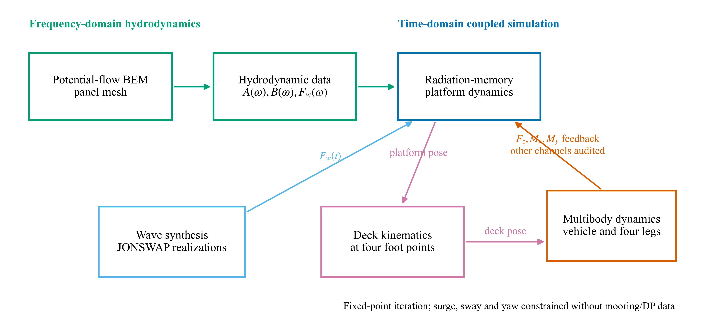
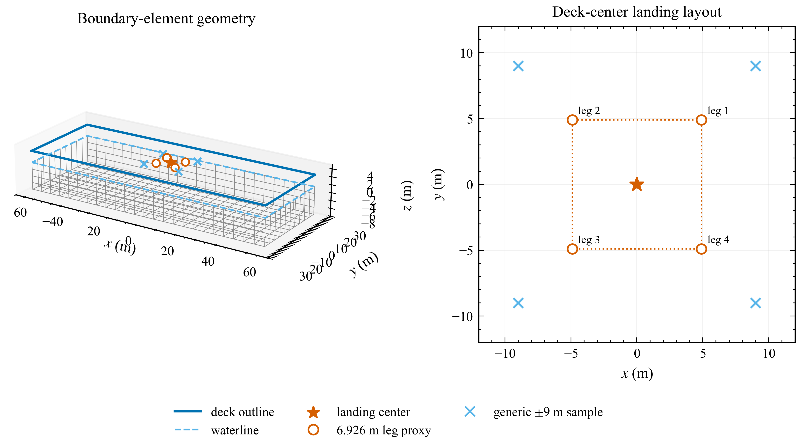
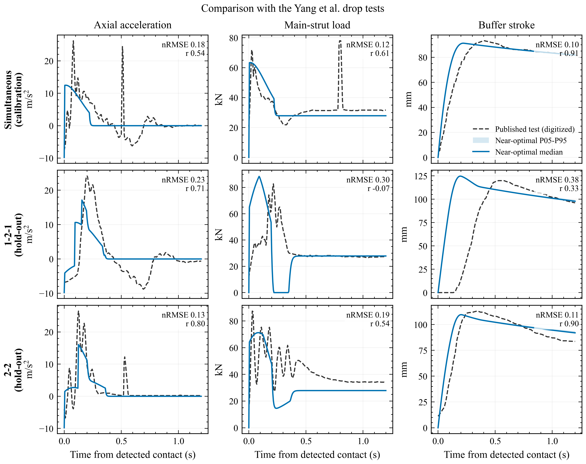
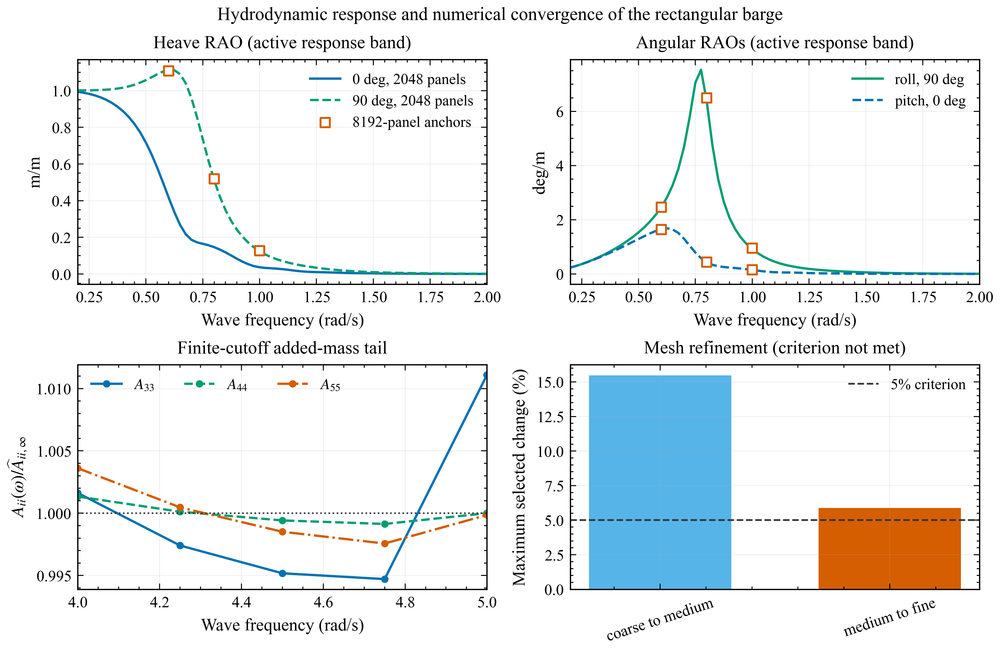
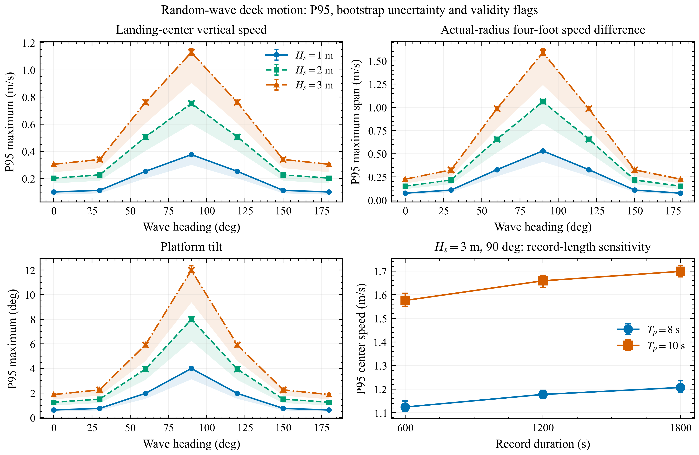
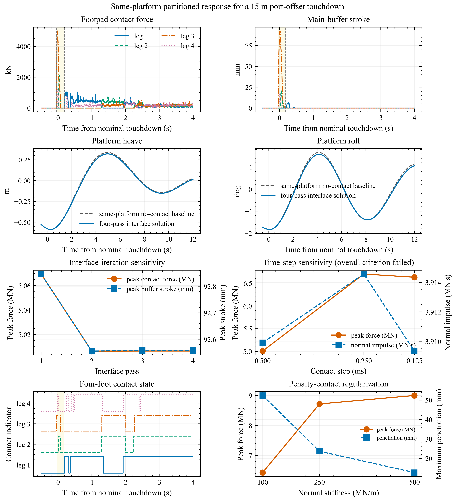
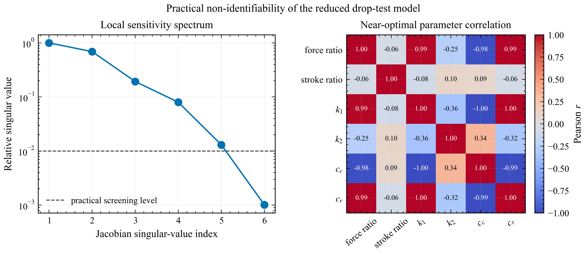
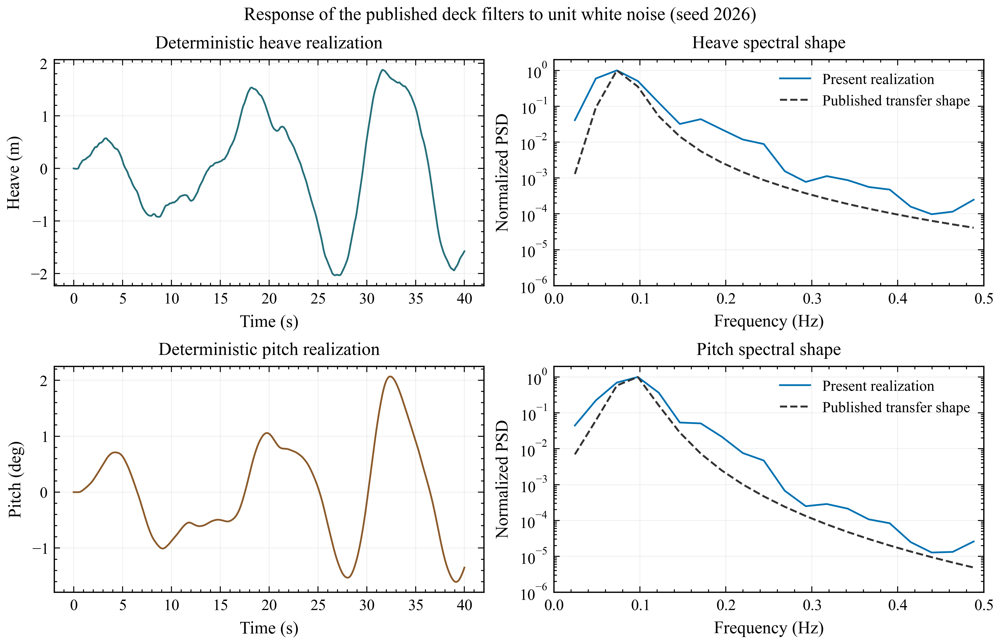

# A Partitioned Hydromechanical Framework for Four Leg Reusable Launch Vehicle Landing on a Floating Barge

## Abstract

The motion relevant to a sea landing is the motion of the intended contact points rather than that of the platform reference point alone. A numerical framework is developed in which frequency-domain wave-body coefficients are transformed into a radiation-memory platform model, local deck kinematics are reconstructed from the platform motion, and four landing feet are allowed to contact, lift off and re-contact independently. The resulting contact force and moment are returned to the same platform operator through a fixed-point partitioned calculation. Verification and validation are reported separately. A reduced landing model, calibrated against one simultaneous-touchdown test from Yang et al., predicts the buffer-stroke peaks in two withheld asymmetric tests within 4.1%, but does not reproduce their acceleration and load histories; 127 of 128 multi-start solutions are near-optimal, so the fitted parameters are not practically identifiable. For a parameterized 120 m by 50 m barge, the medium-grid sampled heave response reaches 1.113 m/m. The prescribed 5% hydrodynamic mesh criterion is not met: the maximum selected change from the medium to fine mesh is 5.88%. Random-wave screening therefore uses the medium-grid response with this limitation retained. One thousand realizations per condition, a non-repeating synthesis grid and bootstrap intervals show that only 41 of 63 conditions remain within the stated linear-motion envelope. In the full-scale illustrative landing, the same barge operator is used for wave, plume-profile and contact loads. Four coupling passes satisfy the 2% interface criterion, whereas contact time-step and stiffness refinements do not establish convergence of peak force, stroke or touchdown interval. The framework consequently supports reproducible investigation of local deck motion and load feedback, but the present contact results are not qualified as vehicle design loads or operational sea-state limits.

Keywords: reusable launch vehicle; floating recovery platform; radiation memory; local deck kinematics; irregular waves; four-leg contact; partitioned coupling

## 1. Introduction

Downrange recovery reduces the propellant required to return a reusable launch-vehicle stage to its launch site, but replaces a fixed landing surface with a moving marine structure. Dynamic positioning can regulate low-frequency horizontal position and heading; it does not remove wave-frequency heave, roll and pitch. The velocity of a point on deck is therefore not, in general, the velocity of the platform reference point. The rotational contribution increases with distance from the reference point and can make nominally identical landing feet encounter different deck heights and vertical velocities.

Hydrodynamic and landing-mechanism studies have usually treated this problem from opposite sides. Nargolkar and Vijayan (2025) combined potential-flow hydrodynamic coefficients, a radiation-memory equation and an equivalent launch-vehicle structure. Their box-barge and MARMAC-type calculations demonstrated that eccentric touchdown couples platform translation and rotation, although the vehicle-platform interface was represented by equivalent springs. Wang et al. (2023) transferred a landing-engine plume history into a wave- and mooring-driven platform calculation. The platform response included the plume load, but the vehicle and its landing mechanism were not retained as dynamic bodies.

Landing-mechanism research has resolved contact in greater detail, generally on a fixed or prescribed moving surface. Thies (2022) examined a four-leg multibody model with nonlinear absorbers, friction and inclined-platform conditions. Yue et al. (2022) compared a quasi-three-dimensional model with scaled drop tests, while Li et al. (2025) included flexible members and a nonlinear liquid-gas absorber. Yang et al. (2026) reported three touchdown sequences and studied the response of a flexible mechanism on a stochastically moving deck. These studies provide useful contact and structural evidence, but the reaction loads do not alter a radiation-memory platform solution. Xie et al. (2025), in the related sea-launch problem, incorporated radiation-memory hydrodynamics in an impact-loaded platform model and compared the resulting motion with experiments.

The unresolved interface is spatial as well as temporal. The platform model must provide the pose and velocity of each foot location, and the landing model must return the force and moment about the same reference point. The short contact event also occurs within a much longer wave and radiation-memory process. A modular treatment is useful because the wave-body boundary-value problem, stochastic wave synthesis and unilateral multibody contact have different natural discretizations and different validation data.

The present work develops this interface as a reproducible proof of concept. Its contribution is threefold. First, six-degree-of-freedom platform response is transformed to the landing center and the actual four-foot footprint, preserving complex phase. Second, the four contacts switch independently and the complete contact wrench is recorded. Third, the vertical force and roll/pitch moments are returned to the same time-domain platform operator and iterated to a stated interface tolerance. The numerical evidence is organized as code verification, submodel validation, literature-trend comparison and an unvalidated full-scale coupled demonstration. This hierarchy prevents a reduced drop-test fit from being used as indirect validation of a different full-scale vehicle. Powered descent, guidance, propellant sloshing, dynamic positioning and nonlinear free-surface effects are outside the present scope.

## 2. Theoretical formulation

### 2.1 Frequency-domain wave-body interaction

The fluid is assumed inviscid, incompressible and irrotational. Incident waves and body motions are sufficiently small for the free-surface and body-boundary conditions to be linearized about the mean wetted surface. The velocity potential satisfies

\[
\nabla^2\varphi=0
\]

in the fluid domain. A free-surface Green function enforces the linearized free-surface, seabed and outgoing-wave conditions. Green's theorem reduces the radiation and diffraction problems to the wetted body surface,

\[
c(P)\varphi(P)+\int_{S_B}\varphi(Q)\frac{\partial G(P,Q)}{\partial n_Q}\,\mathrm dS_Q
=\int_{S_B}G(P,Q)\frac{\partial\varphi(Q)}{\partial n_Q}\,\mathrm dS_Q .
\]

The surface is discretized with constant quadrilateral panels. Six radiation problems and one diffraction problem for each wave heading are solved at every hydrodynamic frequency. Pressure integration yields the added-mass matrix \(\mathbf A(\omega)\), radiation-damping matrix \(\mathbf B(\omega)\), wave-excitation vector \(\mathbf F_w(\omega,\beta)\), and complex response operator. The open boundary-element implementation follows the formulation documented by Liu (2019); the source code is compiled locally for all results reported here.

### 2.2 Radiation-memory platform equation

Following the impulse-response formulation of Cummins (1962), the time-domain platform equation is written about the same reference point as the frequency-domain coefficients,

\[
(\mathbf M+\mathbf A_\infty)\ddot{\boldsymbol\eta}(t)
+\int_0^t\mathbf K_r(t-\tau)\dot{\boldsymbol\eta}(\tau)\,\mathrm d\tau
+\mathbf C_{ext}\dot{\boldsymbol\eta}(t)+\mathbf K_h\boldsymbol\eta(t)
=\mathbf F_w(t)+\mathbf F_p(t)+\mathbf F_c(t),
\]

where \(\boldsymbol\eta=[x,y,z,\phi,\theta,\psi]^T\) denotes surge, sway, heave, roll, pitch and yaw. The rigid-body mass and hydrostatic matrices are \(\mathbf M\) and \(\mathbf K_h\). The supplied additional linear damping is \(\mathbf C_{ext}=\mathbf0\) in every calculation; frequency-dependent radiation damping is retained through the memory term and is not part of \(\mathbf C_{ext}\). Wave, plume and contact loads are denoted by \(\mathbf F_w\), \(\mathbf F_p\) and \(\mathbf F_c\).

The retardation kernel follows from the radiation damping,

\[
\mathbf K_r(t)=\frac{2}{\pi}\int_0^\infty\mathbf B(\omega)\cos(\omega t)\,\mathrm d\omega .
\]

In the numerical model, the positive-semidefinite 0.2-2.0 rad/s radiation band is represented by auxiliary cosine and sine states,

\[
\dot{\mathbf z}_{c,k}=\dot{\boldsymbol\eta}-\omega_k\mathbf z_{s,k},
\qquad
\dot{\mathbf z}_{s,k}=\omega_k\mathbf z_{c,k}.
\]

Trapezoidal frequency weights applied to the cosine states recover the finite-band memory force without storing the full velocity history. Added mass is extended separately to 5 rad/s. The mean of the final five matrices between 4 and 5 rad/s is used as a finite-cutoff estimate of \(\mathbf A_\infty\); it is not described as mathematical infinite-frequency convergence. The high-frequency damping values are excluded from the memory kernel because numerical loss of positive semidefiniteness occurs above the active band.

### 2.3 Deck-point kinematics and irregular waves

Let \(\mathbf r_p=[x_p,y_p,z_p]^T\) be a point fixed to the platform and measured from the hydrodynamic reference point. Under the small-rotation assumption, the point displacement is \(\mathbf u_p=\mathbf u_R+\boldsymbol\theta\times\mathbf r_p\). In component form,

\[
u_x=\eta_1+\eta_5z_p-\eta_6y_p,\qquad
u_y=\eta_2+\eta_6x_p-\eta_4z_p,\qquad
u_z=\eta_3+\eta_4y_p-\eta_5x_p.
\]

The transformation is applied to the complex response operators before a time history is synthesized, and the velocity operator is \(i\omega\) times the displacement operator. Consequently, heave, roll and pitch retain their relative phases at every deck point.

The JONSWAP spectrum is normalized so that

\[
m_0=\int S_\zeta(\omega)\,\mathrm d\omega=\frac{H_s^2}{16}.
\]

For response channel \(j\), one random-phase realization is

\[
x_j(t)=\sum_{n=1}^{N_\omega}\Re\left\{H_j(\omega_n,\beta)
\sqrt{2S_\zeta(\omega_n)\Delta\omega_n}
\exp[i(\omega_nt+\epsilon_n)]\right\}.
\]

The same phase \(\epsilon_n\) is used for every deck channel at frequency \(\omega_n\). The hydrodynamic response is interpolated to a separate stochastic grid with \(\Delta\omega\simeq0.004995\) rad/s. Its nominal repeat period is 1257.95 s, longer than the 600 s record, so the earlier 62.83 s repetition associated with a 0.1 rad/s grid cannot occur. Each sea-state-heading condition contains 1000 deterministic phase sets. The P95 of each record maximum is accompanied by a 95% percentile-bootstrap interval based on 2000 resamples.

### 2.4 Landing structure, absorber and contact

Two landing models serve different evidential purposes. A reduced two-degree-of-freedom model is used only to compare with the 5.2 t drop tests of Yang et al. (2026). It retains vertical translation, pitch and four unilateral contact points. Its compression-only force contains linear and quadratic stiffness and separate compression and rebound damping. Six parameters, including force and stroke observation ratios, are estimated from the simultaneous-touchdown test. The 1-2-1 and 2-2 sequences are predictions with no further parameter adjustment.

The full-scale demonstration uses a rigid central body, four explicit foot bodies, inclined prismatic main guides, elastic diagonal braces and four compression-only absorbers. The total translational mass is closed at 61,288 kg: 60,968 kg is assigned to the central body and 320 kg to the four feet. Because component inertia data are unavailable, the published vehicle inertia remains on the central body. The deployed footprint radius is 6.926 m. Azimuths of 45, 135, 225 and 315 deg are a declared symmetric-layout assumption rather than recovered vehicle CAD.

The absorber force is evaluated from digitized force-stroke and force-velocity curves in Thies (2022),

\[
F_{b,i}=F_s^{dig}(s_i)+F_d^{dig}(\max[\dot s_i,0])+F_{hs}(s_i,\dot s_i),
\]

where linear interpolation is used within the digitized ranges. \(F_{hs}\) is a numerical hard-stop guard beyond the visible stroke range and is not literature data. The tabulated curves are auditable approximations to published figures, not original author data or an exact reconstruction of the proprietary model.

Each spherical foot contacts the moving deck through an explicit compliant normal law. With penetration \(\delta_i>0\), normal relative speed \(v_{n,i}\), contact stiffness \(k_n\), effective contact mass \(m_{eff}\), and damping rate \(G_n\),

\[
F_{n,i}=\max\left[0,k_n\delta_i-m_{eff}G_nv_{n,i}\right].
\]

The production values are \(k_n=100\) MN/m and a configured damping coefficient \(c_n=m_{eff}G_n=10\) kN s/m. The corresponding reference effective mass is 79.998 kg and \(G_n=125.003\) s\(^{-1}\). Static and dynamic friction coefficients are 0.5 and 0.4. This explicit formula resolves the previous ambiguity between the entered damping parameter and the effective pair damping.

The constrained multibody equations have the form

\[
\mathbf M_q(\mathbf q)\ddot{\mathbf q}+\mathbf h(\mathbf q,\dot{\mathbf q})
=\mathbf Q_g+\mathbf Q_{joint}+\mathbf Q_{absorber}+\mathbf Q_{contact}.
\]

The four contact states are independent. First contact, lift-off and re-contact are detected from the discrete state transitions and are reported on the contact integration grid.

### 2.5 Partitioned load feedback

The platform trajectory prescribes deck translation, rotation and their rates in the landing calculation. Position and velocity on the 0.01 s platform grid are interpolated to the contact grid by piecewise cubic Hermite interpolation. The foot reactions are reduced to a complete platform wrench about the hydrodynamic reference point,

\[
\mathbf F_c=-\sum_i\mathbf f_i,
\qquad
\mathbf M_c=-\sum_i(\mathbf r_i-\mathbf r_R)\times\mathbf f_i.
\]

Fine-grid contact loads are transferred back by conservative interval averaging. Heave, roll and pitch are updated because the generated barge has hydrostatic restoring in these coordinates. Surge, sway and yaw have neither mooring nor dynamic-positioning restoring in the supplied model and are therefore held fixed. Their contact-wrench components are calculated and audited but are not injected. The calculation should consequently be read as three-coordinate platform feedback, not a fully closed six-degree-of-freedom station-keeping model.

Starting with the wave- and plume-driven trajectory \(\boldsymbol\eta^{(0)}\), the landing calculation returns \(\mathbf F_c^{(k)}\), after which the platform equation gives \(\boldsymbol\eta^{(k+1)}\). The sequence is repeated until the last update changes the platform trajectory, peak contact force, absorber stroke, touchdown span and contact impulse by no more than 2%. Equal and opposite wrench components are checked before coordinate selection. Figure 1 summarizes this theoretical data flow without treating the individual software implementations as the scientific model.

**Figure 1.** Partitioned hydro-mechanical framework. The complete foot-contact wrench is evaluated; only \(F_z\), \(M_x\) and \(M_y\) are returned to the present platform equation because horizontal restoring data are unavailable.

## 3. Numerical models and assessment procedure

### 3.1 Rectangular recovery barge

The parameterized barge is 120 m long, 50 m wide and 7 m in draft. Still water is \(z=0\), positive \(z\) is upward, and the hydrodynamic reference point is \([0,0,0]\) m. The deck is 3 m above still water. Seawater density is 1025 kg/m3 and gravitational acceleration is 9.80665 m/s2. The geometry gives a displaced volume of 42,000 m3, a waterplane area of 6000 m2 and a displacement mass of 43.05 million kg.

**Figure 2.** Parameterized barge and deck-point layouts. The 6.926 m-radius four-foot layout is used for landing-related statistics. The square \([\pm9,\pm9]\) m points are retained only as generic deck probes.

The rigid-body and hydrostatic properties are generated from a homogeneous rectangular mass model with the center of gravity 2 m below still water (Table 1). They are not as-built inclining-test data. The matrix reference point, center of gravity and pressure integration origin are explicitly distinguished.

**Table 1.** Platform properties used in the frequency- and time-domain calculations.

| Quantity | Value | Reference | Status |
|---|---:|---|---|
| Length, beam, draft | 120, 50, 7 m | Geometry | Prescribed |
| Deck elevation | 3 m | Still-water datum | Prescribed |
| Mass | 43.05 million kg | Density times volume | Geometry-derived |
| Center of gravity | (0, 0, -2) m | Hydrodynamic origin | Assumed homogeneous model input |
| Ixx about CG | 9.3275 billion kg m2 | Rectangular mass model | Generated input |
| Iyy about CG | 52.0188 billion kg m2 | Rectangular mass model | Generated input |
| Izz about CG | 60.6288 billion kg m2 | Rectangular mass model | Generated input |
| K33 | 60.3109 MN/m | Hydrostatic matrix | Geometry-derived |
| K44 | 11.9315 GN m/rad | Hydrostatic matrix | Geometry-derived |
| K55 | 71.7398 GN m/rad | Hydrostatic matrix | Geometry-derived |
| External linear damping | Zero 6 by 6 matrix | Input matrix | Prescribed |

Hydrodynamic refinement uses approximately 512, 2048 and 8192 wetted panels. The coarse and medium calculations contain a 0.025 rad/s grid from 0.2 to 2.0 rad/s and a separate high-frequency tail to 5.0 rad/s, giving 85 frequencies. All seven headings are evaluated on the medium mesh. The fine calculation is restricted to 0.6, 0.8 and 1.0 rad/s at 0 and 90 deg because of its computational cost. The acceptance criterion is a maximum 5% change in selected heave, roll and pitch added mass, radiation damping and non-zero RAO entries at these anchor frequencies. A failed criterion is retained as a limitation rather than overruled from the appearance of the curves.

### 3.2 Random-wave matrix and validity screen

Nine JONSWAP conditions combine \(H_s=1,2,3\) m with \(T_p=6,8,10\) s at \(\gamma=3.3\). Seven headings from 0 to 180 deg produce 63 conditions. Each contains 1000 records of 600 s sampled at 0.1 s. The hydrodynamic response is interpolated from the medium mesh to the stochastic grid described in Section 2.3. Statistics are formed from the maximum within each record, followed by P50, P95, P99 and bootstrap confidence intervals across records.

Two geometric layouts are evaluated. Landing statistics use the 6.926 m-radius footprint of the multibody vehicle. The four \([\pm9,\pm9]\) m points remain in the data file as generic deck probes and are never labelled as the vehicle feet. A condition is inside the linear screen only if the P95 maximum tilt does not exceed 5 deg and no deck edge enters the mean free surface in any realization. This screen is diagnostic: failure indicates that fixed-wetted-surface linear results should not be used quantitatively.

Record-duration sensitivity is assessed separately for the critical \(H_s=3\) m, \(T_p=8\) and 10 s beam-wave conditions. The 600, 1200 and 1800 s calculations share one 1800 s frequency grid and common phase prefixes so that changes are caused by record length rather than unrelated phase samples.

### 3.3 Drop-test comparison and identifiability

Acceleration, main-strut load and buffer-stroke histories are digitized from Figures 9-11 of Yang et al. (2026) using one calibrated axis transform per panel. These dashed curves are reference observations; no digitized ordinate is used as a result of the present calculation. Only simultaneous touchdown is used for parameter estimation. The 1-2-1 and 2-2 sequences are withheld. The normalized root-mean-square error is the ordinary RMSE divided by the maximum absolute value of the corresponding digitized reference trace.

Parameter identifiability is examined with 128 bounded multi-start optimizations. Solutions with objective value no more than 1% above the best value form a near-optimal ensemble. Its parameter distribution, correlation matrix and response envelope distinguish a reproducible prediction band from a unique physical parameter claim. The deck-filter reconstruction formerly shown as a main figure is moved to Supplementary Figure S2 because its unknown white-noise normalization permits only spectral-shape verification.

### 3.4 Same-platform landing calculation

The coupled case uses the 120 m by 50 m platform operator throughout. A deterministic first-order wave load is generated for \(H_s=1.75\) m, \(T_p=4.5\) s, \(\gamma=3.0\), 90 deg heading and seed 2023. Wang et al. (2023) supplies only the temporal form of the plume load. That load is applied to the present platform at \((15,10)\) m and is set to zero at the nominal touchdown time of 510 s. No displacement history from the 165 m Wang platform is replayed or superposed.

The vehicle approaches at a prescribed 5 m/s and lands 15 m to port of the platform center. Gravity is activated after first geometric contact; powered descent and the equal-and-opposite vehicle thrust associated with the pre-touchdown plume are not solved. The plume is therefore a labelled external platform forcing used before contact, not a closed propulsion model. The production contact step is 0.0005 s, the platform step is 0.01 s, and the calculation continues from 506 to 526 s. Four coupling passes are performed. Separate runs use 0.00025 and 0.000125 s contact steps, and the finest step is repeated with normal stiffnesses of 100, 250 and 500 MN/m.

**Table 2.** Models, inputs and evidential roles.

| Model | Main inputs | Numerical setting | Evidential role |
|---|---|---|---|
| Reduced drop-test model | Yang 5.2 t test article; 2 m/s; 0 or 3 deg pitch | 0.001 s; simultaneous fit; two withheld sequences | Submodel comparison and identifiability diagnosis |
| Rectangular platform | Present 120 by 50 by 7 m geometry and generated mass properties | Medium 2048-panel operator; 85 frequencies; 7 headings | Hydrodynamics and local deck-motion screening |
| Four-leg landing demonstration | Thies-based 61.288 t inputs; digitized absorber curves; present platform motion | 0.0005 s production contact step; 0.01 s platform step; four passes | Sequential contact and selected load-feedback demonstration |

### 3.5 Verification and validation hierarchy

Code verification comprises analytic volume and hydrostatic checks, deck-point rigid-body transformations, action-reaction residuals, exact translational mass closure, platform energy balance, and numerical refinement. The repository regression comparator was also applied to the locally generated outputs for its four certification cases, using its registered 10% relative and (10^{-7}) absolute tolerances. It reports 157 file-level failures: 65 for Cylinder, 13 for DeepCwind, 7 for HywindSpar and 72 for Moonpool. The reason for these discrepancies has not been established, so the certification comparison is recorded as failed and provides no validation credit here. Submodel validation is consequently limited to the qualified parts of the Yang drop-test comparison; it does not validate the full-scale vehicle. Literature comparisons with Nargolkar, Wang and Xie are limited to coupling direction, forcing provenance and response trend. No public full-scale sea-touchdown experiment exists for the present barge-vehicle combination. The final calculation is therefore a numerical framework demonstration, not a validated full-scale predictor.

## 4. Results and discussion

### 4.1 Drop-test response and parameter non-uniqueness

The reduced model captures the stroke magnitude more consistently than acceleration or load transfer (Figure 3). Buffer-stroke peak errors are 1.7%, 4.0% and 3.0% for simultaneous, 1-2-1 and 2-2 touchdown. The corresponding acceleration-peak errors are 51.9%, 29.2% and 39.2%. The 1-2-1 main-strut trace has a correlation of -0.071 even though its peak error is 6.7%, demonstrating why peak agreement alone is insufficient.

**Figure 3.** Reduced-model comparison with Yang et al. (2026). Grey dashed lines are baseline-corrected digitized tests; colored lines are present calculations. Parameters are estimated only from simultaneous touchdown. Shaded envelopes show the near-optimal multi-start prediction range.

**Table 3.** Error measures against digitized drop-test histories.

| Case | Response | nRMSE | Correlation | Peak error |
|---|---|---:|---:|---:|
| Simultaneous | acceleration | 0.181 | 0.537 | 51.9% |
| Simultaneous | main-strut load | 0.118 | 0.611 | 18.2% |
| Simultaneous | buffer stroke | 0.101 | 0.911 | 1.7% |
| 1-2-1 | acceleration | 0.232 | 0.707 | 29.2% |
| 1-2-1 | main-strut load | 0.305 | -0.071 | 6.7% |
| 1-2-1 | buffer stroke | 0.377 | 0.333 | 4.0% |
| 2-2 | acceleration | 0.132 | 0.801 | 39.2% |
| 2-2 | main-strut load | 0.192 | 0.543 | 18.7% |
| 2-2 | buffer stroke | 0.106 | 0.899 | 3.0% |

All 128 optimizations terminate successfully, but 127 fall within 1% of the best objective. Strong parameter correlations occur: for example, linear stiffness and compression damping have a correlation of -0.997, while several other pairs exceed an absolute correlation of 0.98. The quadratic stiffness varies by orders of magnitude within the near-optimal ensemble. The public curves constrain selected response features but do not identify a unique physical mechanism. Figure S1 records this result; the full-scale landing model is not calibrated by these reduced-model parameters.

### 4.2 Hydrodynamic response and numerical refinement

The medium-grid sampled maxima are 1.113 m/m for landing-center heave at 0.6 rad/s in beam waves, 7.53 deg/m for roll at 0.775 rad/s in beam waves, and 1.69 deg/m for pitch at 0.65 rad/s near head waves (Figure 4). These are maxima on the evaluated frequency grid, not interpolated continuous-frequency resonances.

**Figure 4.** Present barge hydrodynamics. Response operators use the medium grid. The high-frequency panels show the finite-cutoff added-mass estimate and radiation-memory reconstruction. The mesh bars retain the failed 5% criterion.

Refinement does not support the label mesh-converged. The maximum selected change is 15.46% from coarse to medium and 5.88% from medium to fine, both above the prescribed 5% threshold. The second value is close to the threshold, but it is not rounded into a pass. The medium mesh is used for subsequent calculations because it is the only completed mesh with all seven headings and the dense active frequency grid; this choice carries the measured 5.88% residual refinement uncertainty.

The finite-cutoff estimates of \(A_{33}\), \(A_{44}\) and \(A_{55}\) are 108.315 million kg, 10.303 billion kg m2 and 91.865 billion kg m2. Their relative ranges over the final five samples are 1.638%, 0.220% and 0.605%, respectively. Finite-band retardation-kernel round-trip RMS errors for the same diagonal terms are 3.19%, 6.51% and 3.65%. The active 0.2-2.0 rad/s radiation matrix remains positive semidefinite, with a minimum eigenvalue of 88,931 kg/s. Numerical negative eigenvalues appear in the 3-5 rad/s tail; that tail is therefore used only for the finite-cutoff added-mass estimate, not for time-domain radiation damping.

### 4.3 Random-wave motion at the actual foot locations

The revised stochastic calculation removes the exact short-period repetition and quantifies sampling uncertainty (Figure 5). Across the 63 conditions, the largest 600 s P95 landing-center vertical speed is 1.570 m/s with a 95% bootstrap interval of 1.553-1.598 m/s. It occurs for \(H_s=3\) m, \(T_p=10\) s and 90 deg. The largest P95 vertical-velocity span across the actual 6.926 m-radius feet is 1.591 m/s, with interval 1.559-1.629 m/s, for \(H_s=3\) m, \(T_p=8\) s and 90 deg. The corresponding P95 maximum tilt is 11.99 deg.

**Figure 5.** Statistics from 1000 realizations per condition. Error bars are 95% bootstrap intervals for P95. Crosses identify conditions outside the 5 deg/deck-edge linear validity screen. Actual feet use the 6.926 m-radius layout; generic \([\pm9,\pm9]\) m deck probes are shown only for geometric sensitivity.

These largest values are not physically qualified linear predictions. Only 41 of 63 conditions satisfy the stated linear-motion screen. The two beam-wave conditions producing the largest velocity and tilt fail because of large rotation and deck-edge immersion. At \(H_s=3\) m and \(T_p=10\) s, the largest P95 deck-edge immersion is 2.712 m. The crosses in Figure 5 are therefore central to interpretation rather than cosmetic warnings: results beyond the screen identify where nonlinear hydrostatics, changing wetted surface, green water and viscous roll damping are required.

Record length also matters. For the \(H_s=3\) m, \(T_p=8\) s beam-wave condition, center-speed P95 rises from 1.124 m/s at 600 s to 1.207 m/s at 1800 s, a 6.87% difference. For \(T_p=10\) s it rises from 1.576 to 1.699 m/s, a 7.25% difference. The 600 s values are therefore reported with confidence intervals and duration sensitivity; they are not presented as duration-independent environmental extremes or landing probabilities.

The former \([\pm9,\pm9]\) m square has a 12.73 m radial distance and systematically magnifies rotational point motion relative to the actual footprint. Retaining both layouts confirms the kinematic mechanism, while using only the 6.926 m layout for landing statements removes the earlier geometric mismatch.

### 4.4 Sequential touchdown and platform feedback

The coupled calculation uses one internally consistent platform operator for the baseline and every feedback pass. The wave force, the pre-touchdown plume profile and the returned contact loads all act through the 120 m by 50 m radiation-memory model. Four passes are required. The final third-to-fourth update changes the platform fixed-point metric by 0.145%, peak force by less than 0.001%, absorber stroke by less than 0.001%, touchdown span by 0.87%, and normal impulse by 0.03%; it satisfies the 2% interface criterion.

**Figure 6.** Same-platform four-leg calculation. The yellow interval spans first-to-last initial contact. The 0.5 ms production traces illustrate contact switching and platform feedback. The lower panels show that fixed-point convergence is achieved, while time-step and contact-stiffness convergence of several contact metrics is not.

On the production grid, initial contact proceeds through legs 3, 4, 2 and 1 over 0.229 s. Seventeen lift-offs and seventeen re-contacts are detected before all four feet remain in contact. The final platform trajectory has peak heave, roll and pitch of 0.588 m, 1.834 deg and 0.452 deg. Complete action-reaction residuals are zero to output precision. The largest calculated but omitted horizontal components are 0.424 MN in surge, 1.453 MN in sway and 7.593 MN m in yaw. Their magnitude confirms that the present feedback is not a substitute for a mooring or dynamic-positioning model.

The platform energy ledger provides a code-level check. Wave, plume, contact and radiation work leave a final residual of -15.6 J against the approximately 2.42 MJ final platform mechanical energy, or -6.43e-6 in relative terms. This verifies the implemented platform work balance; it does not validate the contact material or close the prescribed pre-contact vehicle energy and propulsion model.

The contact outputs do not pass numerical qualification (Table 4). At 0.5, 0.25 and 0.125 ms, peak force is 5.006, 6.701 and 6.630 MN, absorber stroke is 92.56, 81.50 and 73.32 mm, and touchdown span is 0.2225, 0.2648 and 0.0613 s. The finest-pair changes are 1.07% for peak force and 4.90% for penetration, but 11.16% for stroke and more than 300% for touchdown span. The normal impulse remains within 0.14%, and platform roll is effectively unchanged.

**Table 4.** Contact time-step refinement; no row is designated converged.

| Contact step | Peak force | Peak stroke | Max penetration | Touchdown span |
|---:|---:|---:|---:|---:|
| 0.500 ms | 5.006 MN | 92.56 mm | 50.15 mm | 0.2225 s |
| 0.250 ms | 6.701 MN | 81.50 mm | 50.00 mm | 0.2648 s |
| 0.125 ms | 6.630 MN | 73.32 mm | 52.58 mm | 0.0613 s |

Contact regularization gives the same warning. At the 0.125 ms step, raising \(k_n\) from 100 to 250 and 500 MN/m changes the peak force from 6.432 to 8.718 and 8.999 MN, and the peak stroke from 73.60 to 84.91 and 94.16 mm. Penetration decreases from 52.42 to 23.64 and 12.65 mm, whereas total normal impulse remains approximately 3.909 MN s. Impulse and platform response are considerably more robust than local peak load and stroke, but this does not rescue the unconverged quantities.

All four feet are in contact at 526 s, and the nozzle-clearance and support-polygon diagnostics remain positive. The final vertical speed is -0.0799 m/s and the angular-rate magnitude is 0.588 deg/s. These exceed the declared settling limits of 0.05 m/s and 0.25 deg/s, so stable standing is not achieved within the simulated interval. Figure 6 is consequently an animation- and mechanism-level demonstration of sequential contact, not evidence of a completed stable landing.

### 4.5 Scope of the numerical evidence

The calculations establish two features that a platform-reference-point analysis misses. Rotation produces location-dependent touchdown conditions even when the reference-point motion is modest, and eccentric contact returns a moment that alters the platform trajectory. Both effects are preserved by the deck-motion/contact-wrench interface.

The same calculations also define where the present model stops being predictive. The severe random-wave cases exceed the fixed-wetted-surface validity envelope. The medium hydrodynamic mesh narrowly misses the stated refinement criterion. The full-scale landing uses literature-derived geometry and digitized absorber curves, while the symmetric leg azimuths, hard-stop extension and component inertia allocation remain assumptions. Contact force, stroke and touchdown time fail refinement or regularization checks. The horizontal platform coordinates lack mooring or dynamic-positioning restoring, and the prescribed approach excludes guidance, thrust dynamics, sloshing and aerodynamic disturbances.

For engineering use, the next stage is therefore not to attach acceptance limits to the current peak values. It is to obtain measured absorber and footpad laws, add horizontal restoring and control, repeat the hydrodynamic refinement with a practical nonlinear roll treatment, and validate the complete coupled system against a dynamic-deck or basin experiment. Until then, the most defensible outputs are the reproducible interface method, local deck-motion diagnostics, robust integral quantities such as impulse, and explicit maps of numerical and physical validity.

## 5. Conclusions

A partitioned framework has been implemented for wave-driven four-leg landing on a floating barge. Frequency-domain hydrodynamics provide a radiation-memory platform equation and complex local deck response. Independent contact states provide sequential touchdown, lift-off and re-contact, while the contact force and moment are returned to the same platform operator through fixed-point iteration.

The Yang comparison supports only a limited submodel claim. Buffer-stroke peaks transfer to two withheld sequences within 4.1%, but acceleration and load waveforms do not. Multi-start optimization shows practical non-identifiability, so no unique landing-mechanism parameters are inferred from the published curves.

The revised barge calculation uses a medium 2048-panel, 0.025 rad/s active grid and a finite-cutoff added-mass tail to 5 rad/s. The medium-to-fine selected change is 5.88%, above the 5% target. Random-wave synthesis uses a separate non-repeating grid, 1000 realizations and bootstrap uncertainty. Forty-one of 63 conditions remain inside the linear validity screen; the largest apparent responses fall outside it and are not operational predictions.

The independent repository certification comparison is not passed by the current locally generated outputs. Its 157 file-level failures remain unresolved and are reported separately from the present geometry, hydrostatic, transformation and energy checks. Accordingly, no claim of solver certification is made from this calculation set.

The same-platform landing reaches the stated fixed-point tolerance after four passes, but local contact quantities do not converge under time-step and stiffness refinement. Four-foot final contact is reached without satisfying the stable-standing diagnostic. The current full-scale calculation therefore demonstrates the coupling mechanism and its audit trail, not qualified leg loads, landing success or an allowable sea state.

## Data and code availability

The accompanying project contains case inputs, panel meshes, locally calculated hydrodynamic coefficients, deck-point response operators, realization-level random-wave statistics, digitized reference targets, full multibody histories, numerical-refinement reports and figure-generation code. Literature curves and parameters are labelled as reference observations or published inputs. Present calculations are stored separately and linked by SHA-256 hashes in the research-integrity audit. Re-execution commands and unresolved limitations are supplied with that audit.

## Supplementary numerical evidence

**Figure S1.** Multi-start identifiability study for the reduced Yang comparison. The ensemble demonstrates non-uniqueness of the fitted physical parameters.

**Figure S2.** Deterministic realizations and normalized spectral shapes reconstructed from the published deck filters. Absolute variance and phase are not validation targets because the original white-noise normalization and random seed are unavailable.

## References
