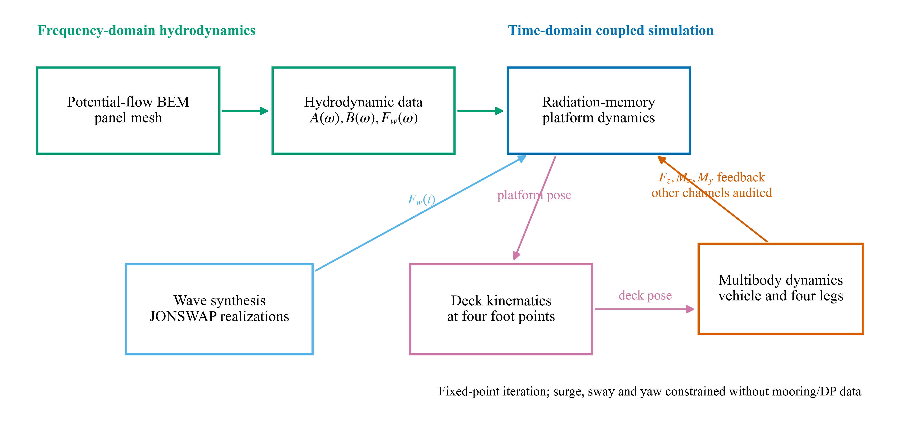
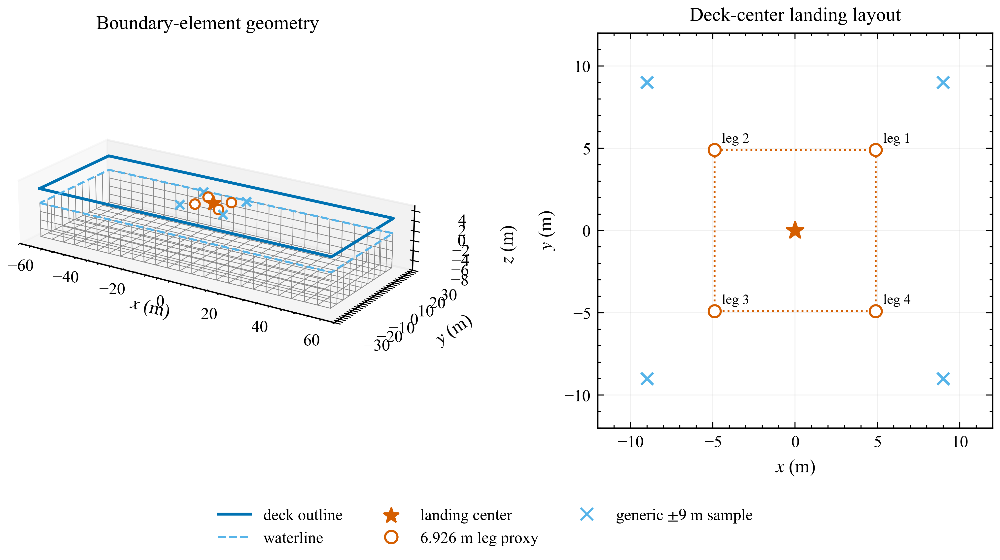
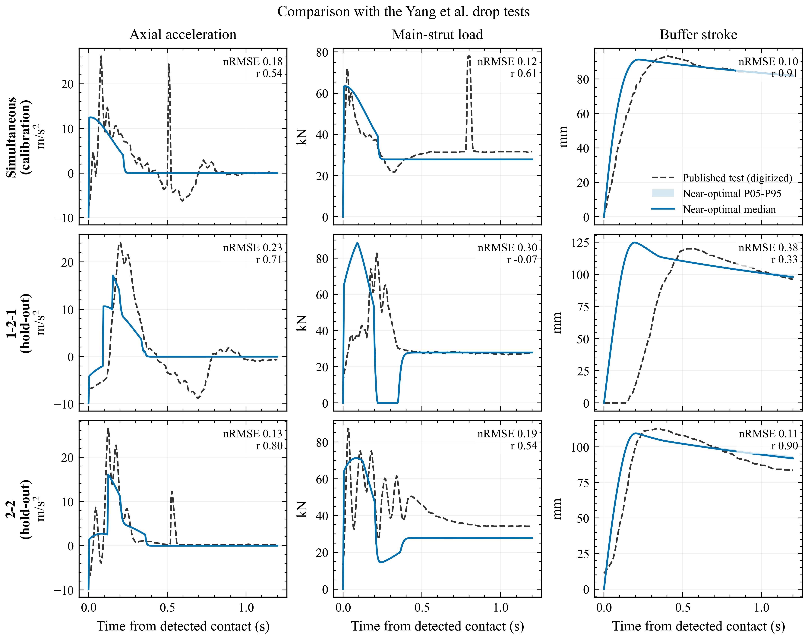
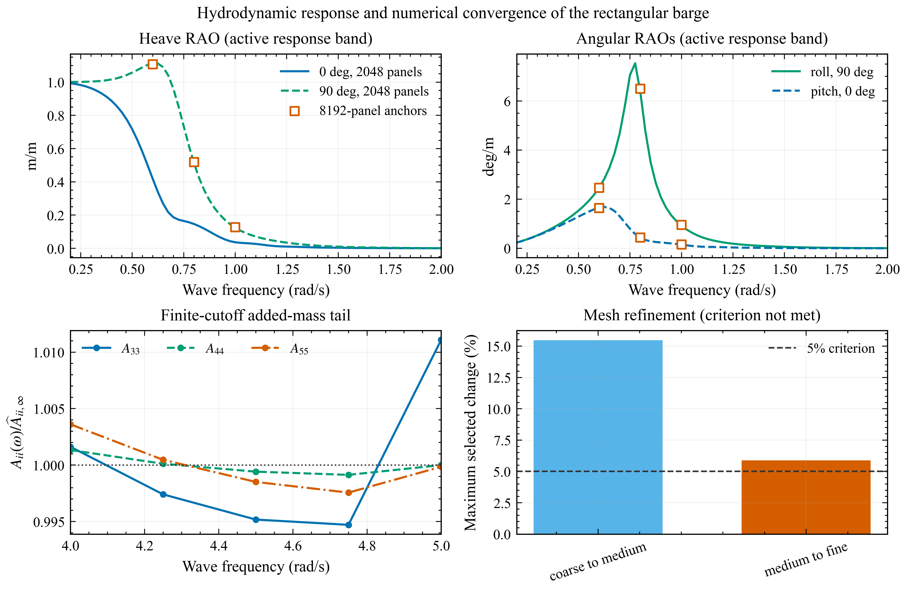
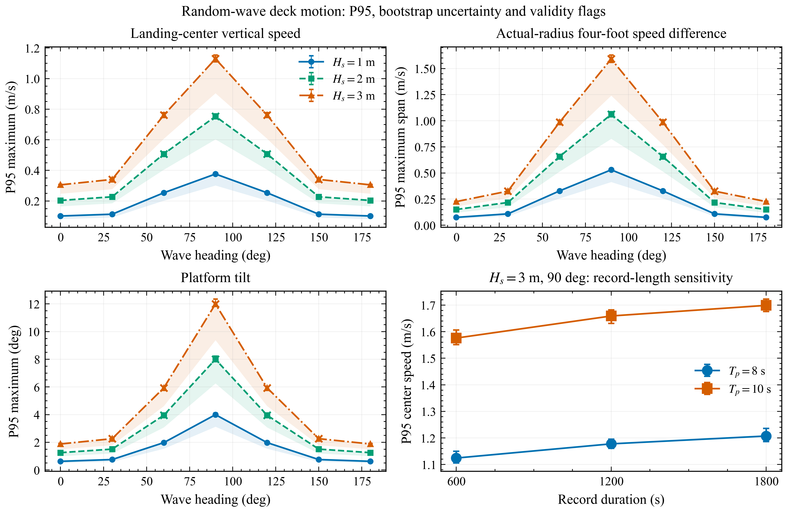
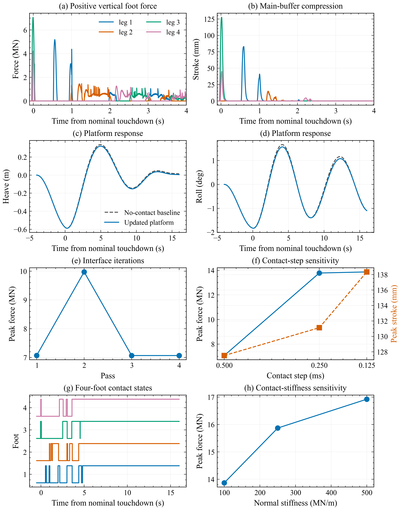
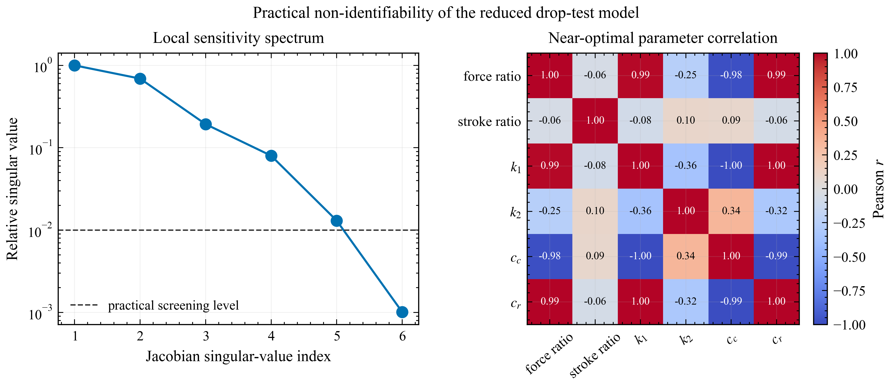
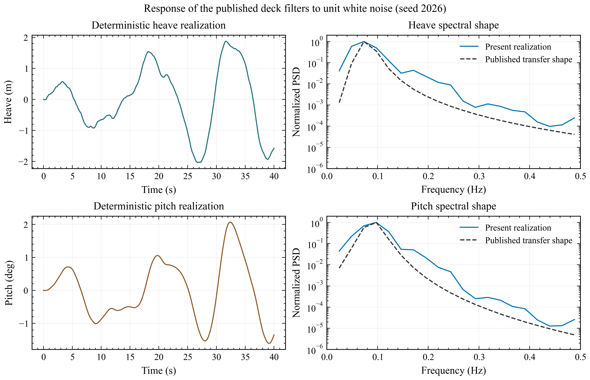

# A Partitioned Hydromechanical Framework for Four-Leg Reusable Launch Vehicle Landing on a Floating Barge

> Corrected computational revision, 28 September 2026. Figure 6 and Table 4 use new coupled-contact integrations. Numerical qualification and physical validation are distinguished explicitly.

## Abstract

Landing on a floating platform depends on motion at the contact points, where platform rotation contributes to both displacement and velocity. A partitioned formulation combines frequency-domain wave-body interaction, finite-band radiation memory and independent four-foot contact. Complex response operators transfer platform motion to the landing footprint, and the contact wrench supplies the platform feedback. A reduced comparison with the drop tests of Yang et al. gives buffer-stroke peak errors below 4.1% for two asymmetric sequences using parameters fitted only to simultaneous touchdown. Acceleration and force histories remain discrepant, while 127 of 128 multi-start fits are near-optimal, indicating poor practical identifiability. For a prescribed 120 m by 50 m barge, the sampled heave response reaches 1.113 m/m. The selected medium-to-fine mesh change is 5.88%, above the 5% criterion. Screening with 1000 random-wave realizations per condition and bootstrap intervals places 41 of 63 conditions within a preliminary linear-motion envelope. These statistics describe finite-record deck-motion extremes, not landing success. The corrected full-scale calculation meets the 2% interface update criterion after 4 passes. Its peak positive vertical foot force is 7.067 MN and peak buffer stroke is 127.52 mm. The contact-step study does not meet the joint 5% criterion. These are newly integrated responses of the stated proxy model, not validated full-scale landing loads.

Keywords: reusable launch vehicle; floating recovery platform; radiation memory; local deck kinematics; irregular waves; four-leg contact; partitioned coupling

## 1. Introduction

Downrange recovery replaces a fixed landing surface with a wave-driven structure. Position and heading control do not, by themselves, remove wave-frequency heave, roll or pitch. A landing foot therefore encounters the local deck velocity, including the rotational contribution at its position, rather than the reference-point velocity alone. Because that contribution depends on the lever arm, feet on the same vehicle can encounter different deck elevations and vertical velocities during a nominally simultaneous approach.

Existing studies address either platform response or landing-mechanism dynamics in greater detail. Nargolkar and Vijayan (2025) coupled potential-flow coefficients and a radiation-memory equation to an equivalent launch-vehicle structure. Their box-barge and MARMAC-type examples showed how eccentric touchdown couples translation and rotation, using equivalent springs at the vehicle-platform interface. Wang et al. (2023) applied a landing-engine plume history to a platform driven by waves and mooring forces. That calculation retained the platform response to the plume, but did not solve the vehicle and its landing mechanism as interacting dynamic bodies.

Landing-mechanism studies resolve contact and energy absorption more explicitly, usually with a fixed or prescribed landing surface. Thies (2022) examined a four-leg multibody model and nonlinear absorbers, including landing conditions involving inclination and friction. Yue et al. (2022) compared a reduced landing model with scaled drop tests. Crushing-type gear has also been examined by impact modeling and experimental comparison (Wang et al., 2023, Actuators), while Li et al. (2025) considered flexible members and a nonlinear liquid-gas absorber. Yang et al. (2026) reported three touchdown sequences and investigated mechanism flexibility under stochastic deck excitation. These provide evidence for individual mechanisms or prescribed-motion response. They do not validate the particular reaction-coupled radiation-memory calculation considered here. For the related sea-launch problem, Xie et al. (2025) combined hydrodynamic memory with impact loading and compared platform motions with experiments.

Linking the two subproblems requires consistent spatial and temporal interfaces. The platform solution must provide the pose and velocity of each potential contact location. The landing solution must return forces and moments in compatible axes and about a declared reference point. These exchanges occur across different time scales: contact develops over a short interval, whereas waves and radiation memory act throughout the surrounding record. Separate solvers are useful only when their coordinate transformations, load transfer and numerical errors remain explicit.

This study develops and assesses the interface between linear platform hydrodynamics and independent four-foot contact. The formulation transfers complex platform response operators to the landing center and footprint, resolves separate foot-contact states, and returns vertical force and roll/pitch moments to the same platform operator. Its contribution lies in the motion and load interfaces, case construction and numerical assessment; the boundary-element, radiation-memory and rigid-body formulations are established methods. The reduced 5.2 t drop-test comparison and the full-scale example are evaluated separately because they use different vehicle models and parameters. Powered descent, guidance, propellant sloshing, dynamic positioning and nonlinear free-surface effects are outside the present scope. The full-scale example uses the coordinate-consistent and impulse-preserving implementation described in Sections 2.4-2.5; its numerical limitations are assessed separately from the reduced drop-test comparison.

## 2. Theoretical formulation

### 2.1 Frequency-domain wave-body interaction

The hydrodynamic subproblem assumes an inviscid, incompressible and irrotational fluid. The free-surface and body-boundary conditions are linearized about the mean water level and mean wetted surface. Under these assumptions, the velocity potential satisfies

\[
\nabla^2\varphi=0
\]

throughout the fluid domain. The free-surface Green function satisfies the linearized free-surface, seabed and outgoing-wave conditions. Applying Green's theorem reduces the radiation and diffraction problems to an integral equation on the wetted surface,

\[
c(P)\varphi(P)+\int_{S_B}\varphi(Q)\frac{\partial G(P,Q)}{\partial n_Q}\,\mathrm dS_Q
=\int_{S_B}G(P,Q)\frac{\partial\varphi(Q)}{\partial n_Q}\,\mathrm dS_Q .
\]

Constant quadrilateral panels discretize the wetted surface. At each hydrodynamic frequency, six radiation problems and the heading-dependent diffraction problem are solved. Integrating pressure gives the added-mass matrix \(\mathbf A(\omega)\), radiation-damping matrix \(\mathbf B(\omega)\), wave-excitation vector \(\mathbf F_w(\omega,\beta)\), and complex response operators. HAMS supplies the open-source boundary-element implementation described by Liu (2019). The present contribution is the case definition, response processing and contact coupling, not a new boundary-element solver. The archive contains locally generated coefficients and their inputs; the review separately rebuilt the supplied Fortran source and reran the explicitly identified cases. Compilation and reproducibility do not, on their own, establish solver accuracy.

### 2.2 Radiation-memory platform equation

The platform response is expressed using the impulse-response formulation of Cummins (1962). The mass, hydrodynamic and restoring matrices must refer to the same body reference point and axes. In six-coordinate notation,

\[
(\mathbf M+\mathbf A_\infty)\ddot{\boldsymbol\eta}(t)
+\int_0^t\mathbf K_r(t-\tau)\dot{\boldsymbol\eta}(\tau)\,\mathrm d\tau
+\mathbf C_{ext}\dot{\boldsymbol\eta}(t)+\mathbf K_h\boldsymbol\eta(t)
=\mathbf F_w(t)+\mathbf F_p(t)+\mathbf F_c(t),
\]

where \(\boldsymbol\eta=[x,y,z,\phi,\theta,\psi]^T\) contains surge, sway, heave, roll, pitch and yaw. The matrices \(\mathbf M\) and \(\mathbf K_h\) denote rigid-body mass and hydrostatic restoring. The additional linear damping matrix is prescribed as \(\mathbf C_{ext}=\mathbf0\) in the reported calculations. Radiation damping remains in the memory integral and is not removed by this choice. Wave excitation, the prescribed plume load and contact feedback are \(\mathbf F_w\), \(\mathbf F_p\) and \(\mathbf F_c\), respectively. The full-scale demonstration solves only the heave-roll-pitch subsystem; the six-coordinate expression defines the interface and should not be read as a six-degree-of-freedom feedback result.

The retardation kernel follows from the radiation damping,

\[
\mathbf K_r(t)=\frac{2}{\pi}\int_0^\infty\mathbf B(\omega)\cos(\omega t)\,\mathrm d\omega .
\]

The retained radiation band is 0.2-2.0 rad/s. Its selected heave-roll-pitch damping submatrices pass the archived positive-semidefinite check. The finite-band convolution is represented by auxiliary cosine and sine states for each frequency,

\[
\dot{\mathbf z}_{c,k}=\dot{\boldsymbol\eta}-\omega_k\mathbf z_{s,k},
\qquad
\dot{\mathbf z}_{s,k}=\omega_k\mathbf z_{c,k}.
\]

Trapezoidal weights in frequency combine the cosine states into the memory force. This representation avoids retaining the entire velocity history, but does not remove frequency truncation or quadrature error. Added-mass calculations extend to 5 rad/s. The mean of the final five matrices over 4-5 rad/s supplies a finite-cutoff approximation to \(\mathbf A_\infty\). No mathematical infinite-frequency convergence is claimed. Damping above the active band is excluded because the computed tail loses positive semidefiniteness. The added-mass tail and damping restriction must therefore be assessed as separate approximations.

Reciprocity is checked on the raw coefficients before symmetrization. Translation and length-scaled rotation coordinates use a 120 m reference length so that the comparison respects the work pairing of generalized forces and velocities. The Frobenius-norm ratio \(\|\widetilde{\mathbf B}-\widetilde{\mathbf B}^{T}\|_F/\|\widetilde{\mathbf B}\|_F\) reaches 0.803% within 0.2-2.0 rad/s and 36.65% at 5 rad/s. Small negative eigenvalues also occur in the full six-coordinate damping matrix within the retained band. Positivity of the selected three-coordinate block consequently does not demonstrate six-coordinate passivity. Neither symmetrization nor exclusion of the unreliable tail establishes frequency-domain/time-domain consistency; the combined impedance obtained from the retained kernel and finite-cutoff added mass has not yet been verified against the original frequency-domain operator.

### 2.3 Deck-point kinematics and irregular waves

For a platform-fixed point \(\mathbf r_p=[x_p,y_p,z_p]^T\), measured from the hydrodynamic reference point, the first-order rigid-body displacement is \(\mathbf u_p=\mathbf u_R+\boldsymbol\theta\times\mathbf r_p\). Thus,

\[
u_x=\eta_1+\eta_5z_p-\eta_6y_p,\qquad
u_y=\eta_2+\eta_6x_p-\eta_4z_p,\qquad
u_z=\eta_3+\eta_4y_p-\eta_5x_p.
\]

This transformation is applied to complex response operators before wave synthesis. The corresponding velocity operator is \(i\omega\) times the displacement operator. Performing the transformation before taking amplitudes preserves the relative phase of heave, roll and pitch. Adding their absolute amplitudes would instead give a different, generally overconservative point response. The same point coordinates are used in all channels belonging to one realization.

The JONSWAP spectrum is normalized so that

\[
m_0=\int S_\zeta(\omega)\,\mathrm d\omega=\frac{H_s^2}{16}.
\]

For response channel \(j\), one random-phase realization is

\[
x_j(t)=\sum_{n=1}^{N_\omega}\Re\left\{H_j(\omega_n,\beta)
\sqrt{2S_\zeta(\omega_n)\Delta\omega_n}
\exp[i(\omega_nt+\epsilon_n)]\right\}.
\]

Every response channel uses the same phase \(\epsilon_n\) at a given frequency, preserving cross-channel coherence. The medium-mesh hydrodynamic response is interpolated onto a separate synthesis grid with \(\Delta\omega\simeq0.004995\) rad/s. Its nominal repeat period is 1257.95 s, exceeding the 600 s record. This avoids the earlier 62.83 s repetition associated with 0.1 rad/s spacing; it does not imply that a finite discrete spectrum is aperiodic at arbitrary duration. Each sea-state-heading combination uses 1000 reproducible phase sets. We compute a maximum within each record, then the P95 across records, with a 95% percentile-bootstrap interval from 2000 resamples. The interval describes finite-ensemble uncertainty conditional on the selected response operator and spectrum. It excludes mesh, model-form and digitization uncertainty.

### 2.4 Landing structure, absorber and contact

The reduced drop-test model and full-scale multibody model have different purposes and parameters. The reduced model compares with the 5.2 t tests of Yang et al. (2026). It retains downward translation \(d\), pitch \(\alpha\) and four unilateral contact points. With projected support coordinates \(a_i\) and initial gaps \(g_i\), compression is \(\delta_i=d+(\alpha-\alpha_0)a_i-g_i\). A positive compression produces the clipped resultant of linear and quadratic spring terms and separate compression/rebound damping. The equations integrated in this comparison are

\[
m\ddot d=mg-\sum_i F_{z,i},\qquad I_\alpha\ddot\alpha=-\sum_i a_iF_{z,i}.
\]

The support radius is \(2.65\sqrt{2}\) m, and the pitch inertia is the declared approximation \(I_\alpha=mR^2\). The reported main-strut force is \(F_{z,i}/r_F\), and the reported stroke is \(\mathrm{clip}(\max[\delta_i,0]/r_s,0,0.25\,\mathrm m)\). The observation ratios \(r_F\) and \(r_s\) are fitted parameters, not independently measured lever ratios. The 0.25 m output clip is not a modeled mechanical stop. Together with the two stiffness and two damping coefficients, these give six calibrated parameters. Only simultaneous touchdown enters parameter estimation. The same fitted values are used for the 1-2-1 and 2-2 comparisons.

The full-scale example contains a rigid central body, four explicit spherical foot bodies, inclined prismatic main guides, elastic diagonal braces and four compression-only absorbers. The archived translational mass allocation is 60,968 kg for the central body and 320 kg for the feet, totaling 61,288 kg. The 6.926 m footprint and assumed azimuths of 45, 135, 225 and 315 deg define a symmetric mechanism proxy. They are not recovered vehicle CAD.

A coordinate audit changes the interpretation of the archived contact results. Thies (2022, Table 3 and Figure 7) gives \(I_{xx}=2.57\times10^7\), \(I_{yy}=3.76\times10^5\) and \(I_{zz}=2.57\times10^7\) kg m2 in a Y-up frame. The present contact model is Z-up. With \((x_{new},y_{new},z_{new})=(x_{old},-z_{old},y_{old})\), the tensor must be transformed as \(\mathbf I_{new}=\mathbf R\mathbf I_{old}\mathbf R^T\), giving

\[
\mathbf I_{total}^{Z\text{-up}}=\operatorname{diag}(2.57\times10^7,\,2.57\times10^7,\,3.76\times10^5)\;\mathrm{kg\,m^2}.
\]

The archived code assigned the small longitudinal inertia to its horizontal x axis. Consequently, its x-axis inertia is smaller than the correctly mapped total value by a factor of 68.35, before component allocation. The histories reported in Section 4.4 have been recomputed with the corrected mapping. The implementation closes mass, center of gravity and inertia for the assumed reference configuration by subtracting the explicit foot-body contributions with the parallel-axis theorem. This gives a central-body reference height of 22.17373 m and principal inertias of approximately \((2.5538616\times10^7,2.5538616\times10^7,3.6064448\times10^5)\) kg m2. These are calculated proxy inputs, not new vehicle measurements or new landing results; articulated motion subsequently changes the composite inertia.

The absorber force is evaluated from digitized force-stroke and force-velocity curves in Thies (2022),

\[
F_{b,i}=F_s^{dig}(s_i)+F_d^{dig}(\max[\dot s_i,0])+F_{hs}(s_i,\dot s_i),
\]

Linear interpolation evaluates the digitized tables within their visible ranges. The additional term \(F_{hs}\) is a numerical hard-stop guard outside the tabulated stroke range. It must be identified as an assumed numerical extension rather than attributed to the reference paper. The digitized curves approximate published figures; they are neither original experimental records obtained in this study nor an exact reconstruction of the proprietary absorber model. Their use defines a literature-based input law and does not independently validate the resulting contact dynamics.

Each spherical foot contacts the moving deck through an explicit compliant normal law. With penetration \(\delta_i>0\), normal relative speed \(v_{n,i}\), contact stiffness \(k_n\), effective contact mass \(m_{eff}\), and damping rate \(G_n\),

\[
F_{n,i}=\max\left[0,k_n\delta_i-m_{eff}G_nv_{n,i}\right].
\]

The archived production settings are \(k_n=100\) MN/m and \(c_n=m_{eff}G_n=10\) kN s/m. The reference effective mass is 79.998 kg, giving \(G_n=125.003\) \(s^{-1}\). Static and dynamic friction coefficients are prescribed as 0.5 and 0.4. The code explicitly selects coefficient-based compliant contact, distinguishing the entered damping rate from the effective force coefficient. These remain prescribed numerical contact parameters; a measured footpad-deck law is unavailable.

The archived scalar output named `leg_contact_force_n` is \(\max(f_z,0)\) in world coordinates. It is not the normal projection on the moving deck. Accordingly, archived force peaks and impulses below are labeled positive vertical contact quantities. A normal quantity requires \(F_n=\max(\mathbf f\cdot\mathbf n_{deck},0)\). The integration-grid recorder stores that projection separately, while retaining the original field with an explicit compatibility label. No archived vertical-force trace is reclassified as a recomputed normal-force trace.

The constrained multibody equations have the form

\[
\mathbf M_q(\mathbf q)\ddot{\mathbf q}+\mathbf h(\mathbf q,\dot{\mathbf q})
=\mathbf Q_g+\mathbf Q_{joint}+\mathbf Q_{absorber}+\mathbf Q_{contact}.
\]

Each foot has its own contact state. A sample is classified as contact when positive vertical force exceeds 100 N or normal penetration exceeds 10 micrometers. First contact, lift-off and re-contact are detected from transitions of this indicator, so event times inherit the contact step and these thresholds. Gravity activation separately uses the first force-threshold crossing. All recorded integration nodes are retained for peak and event audits; compact plotting histories are separate derived files. The event indicator and deck-normal force projection are distinct quantities.

### 2.5 Partitioned load feedback

The landing calculation receives a prescribed platform trajectory over each partitioned pass. Piecewise cubic Hermite interpolation uses paired positions and velocities from the 0.01 s platform grid to evaluate contact-grid kinematics. Forces on the feet are reduced to the equal-and-opposite platform force and moment about the platform reference point,

\[
\mathbf F_c=-\sum_i\mathbf f_i,
\qquad
\mathbf M_c=-\sum_i(\mathbf r_i-\mathbf r_R)\times\mathbf f_i.
\]

The full wrench is assembled before coordinate selection. The current platform feedback retains \(F_z\), \(M_x\) and \(M_y\); surge, sway and yaw are constrained kinematically. Missing mooring or dynamic-positioning data do not physically suppress horizontal response. The computed horizontal forces and yaw moment therefore represent reactions that the imposed constraint must carry. The model does not predict the response of a freely drifting or actively station-kept platform.

The fine-grid wrench is integrated as a piecewise-linear function over intervals bounded by target-time midpoints. Each interval integral is divided by its width. With identical source and target endpoints, the half-width end intervals make the target-grid trapezoidal impulse equal to the fine-grid impulse in all six components. This operation replaces pointwise interpolation in the executed feedback path. It preserves resultant impulse, not force peaks or interface work; contact-step and platform-response accuracy require separate checks.

Beginning with the wave- and plume-driven trajectory \(\boldsymbol\eta^{(0)}\), one landing solve gives \(\mathbf F_c^{(k)}\), and one platform solve gives \(\boldsymbol\eta^{(k+1)}\). The same 2% update criterion is applied to the platform trajectory, peak positive vertical force, stroke, touchdown span and positive vertical impulse. Iteration stops after at least two passes when all criteria are met, with an eight-pass limit. Reaching that limit without closure is reported as failure. Production, time-step and stiffness cases use this identical stopping rule.

The wrench reducer constructs equal-and-opposite arrays from the same foot-force samples. A zero residual therefore checks sign and reference-point assembly rather than independently verifying the deck reaction. An independent comparison requires reactions recorded on the second body or a separate benchmark. Contact power also requires force, moment and velocity to refer to the same point on each body. Pairing a platform-origin moment with the vehicle center-of-gravity velocity does not satisfy that requirement, particularly when the forces act on articulated feet. The mixed-reference work proxy is excluded from the energy evidence; Figure 1 depicts the implemented motion and resultant-load interface, not an independent contact-energy validation.

**Figure 1.** Partitioned hydro-mechanical framework. The complete foot-contact wrench is evaluated; only \(F_z\), \(M_x\) and \(M_y\) are returned to the present platform equation under the imposed surge, sway and yaw constraints.

## 3. Numerical models and assessment procedure

### 3.1 Rectangular recovery barge

The prescribed barge geometry is 120 m by 50 m with a 7 m draft. The hydrodynamic origin lies at \([0,0,0]\) m on mean water level, with z positive upward and deck elevation 3 m. Seawater density is 1025 kg/m3 and gravity is 9.80665 m/s2. The resulting displaced volume, waterplane area and displacement mass are 42,000 m3, 6000 m2 and 43.05 million kg. These parameters define the numerical case rather than an as-built recovery vessel.

**Figure 2.** Parameterized barge and deck-point layouts. The 6.926 m-radius four-foot layout is used for landing-related statistics. The square \([\pm9,\pm9]\) m points are retained only as generic deck probes.

A prescribed center of gravity 2 m below mean water level and a homogeneous rectangular mass approximation define the rigid-body properties in Table 1. Hydrostatic terms are generated from the geometry. These are model inputs, not inclining-test measurements. The frequency-domain matrix origin, mass center and load-reference point are distinguished explicitly.

The collision deck reads its 120 m by 50 m dimensions and 3 m elevation from the hydrodynamic-platform configuration. One rotation convention defines its collision pose, surface normal, local point coordinates and spatial angular velocity. The deck-center velocity includes the rotational offset from the platform reference point. Contact moments are evaluated about the instantaneous platform reference rather than an unrelated fixed world origin. The pre-correction archive is retained separately for traceability.

**Table 1.** Platform properties used in the frequency- and time-domain calculations.

| Quantity | Value | Reference | Status |
|---|---:|---|---|
| Length, beam, draft | 120, 50, 7 m | Geometry | Prescribed |
| Deck elevation | 3 m | Still-water datum | Prescribed |
| Mass | 43.05 million kg | Density times volume | Geometry-derived |
| Center of gravity | (0, 0, -2) m | Hydrodynamic origin | Assumed homogeneous model input |
| Ixx about CG | 9.3275 billion kg m2 | Rectangular mass model | Generated input |
| Iyy about CG | 52.0188 billion kg m2 | Rectangular mass model | Generated input |
| Izz about CG | 60.6288 billion kg m2 | Rectangular mass model | Generated input |
| K33 | 60.3109 MN/m | Hydrostatic matrix | Geometry-derived |
| K44 | 11.9315 GN m/rad | Hydrostatic matrix | Geometry-derived |
| K55 | 71.7398 GN m/rad | Hydrostatic matrix | Geometry-derived |
| External linear damping | Zero 6 by 6 matrix | Input matrix | Prescribed |

The coarse, medium and fine meshes contain approximately 512, 2048 and 8192 wetted panels. Coarse and medium calculations use 0.025 rad/s spacing over 0.2-2.0 rad/s plus a higher-frequency tail to 5.0 rad/s, totaling 85 frequencies. The medium mesh covers seven headings. The archived fine calculation covers only 0.6, 0.8 and 1.0 rad/s at 0 and 90 deg. The predefined criterion is a maximum 5% change in selected heave, roll and pitch added mass, damping and non-zero response entries at those anchors. The criterion is applied to the selected numerical entries rather than inferred from curve smoothness. Because 0.775 rad/s is not a fine-mesh anchor, that comparison does not resolve the sampled roll peak.

### 3.2 Random-wave matrix and validity screen

The wave matrix combines \(H_s=1,2,3\) m, \(T_p=6,8,10\) s and \(\gamma=3.3\) with seven headings from 0 to 180 deg. This gives 63 conditions, each containing 1000 records of 600 s at 0.1 s spacing. The medium-mesh response is interpolated to the separate synthesis grid in Section 2.3. We retain realization-level maxima, then calculate P50, P95, P99 and bootstrap confidence intervals across records. A seed identifies a reproducible phase realization; it does not identify a measured sea-state record.

The archived screening spectra are normalized over 0.2-5.0 rad/s. Holding phases and transfer functions fixed, a full-spectrum normalization audit changes the retained-band response amplitudes by at most 0.079%. This evaluates normalization, not the missing response outside the computed band. The full-scale landing operator uses wave and radiation frequencies only up to 2.0 rad/s. Its narrower cutoff requires its own assessment and cannot be justified by the screening normalization result.

The landing-related channels use the assumed 6.926 m-radius multibody footprint. The four \([\pm9,\pm9]\) m locations remain as generic deck probes, with different labels. A preliminary linear-motion screen accepts a condition only when the P95 maximum tilt is at most 5 deg and no deck edge crosses mean water level in any realization. This is an explicitly selected diagnostic, not a certified operating criterion. A failed condition is retained to indicate model breakdown, not used as a quantitative prediction of a nonlinear response.

The clearance screen compares the moving deck edge with mean water level. It omits local incident and diffracted surface elevation, so passing it does not establish that the deck remains dry. The 41 accepted conditions are a preliminary subset under these definitions; they are not confirmed wetting-free or safe landing conditions.

Duration sensitivity is examined separately for the \(H_s=3\) m, \(T_p=8\) and 10 s beam-wave cases. Records of 600, 1200 and 1800 s use one frequency grid designed for 1800 s and common phase prefixes. This holds the stochastic construction fixed while changing observation duration. The shorter-prefix estimates need not equal those from the independent 600 s screening grid.

### 3.3 Drop-test comparison and identifiability

Acceleration, main-strut load and buffer stroke are digitized from Figures 9-11 of Yang et al. (2026), with a calibrated axis transform for each panel. These provide external comparison targets. The present model histories are produced by integrating the reduced equations; digitized ordinates are not relabeled as present results. Only the simultaneous-touchdown data enter parameter fitting. Parameters remain frozen for both asymmetric cases.

Preprocessing is part of the comparison definition. The force baseline is the median over the first 13% of digitized time samples. After baseline subtraction and non-negative clipping, contact begins at the first sample reaching 8% of the corrected peak force. The stroke baseline is estimated before that contact time. Each reference case is aligned to its own detected contact, and millimeters are converted to meters. Thus, the asymmetric comparisons are withheld from fitting but are reference-aligned waveform tests, not blind predictions of absolute touchdown time.

Bounded least squares uses 181 comparison times over 0-1.2 s and a 0.002 s model step during fitting. Acceleration, force and stroke residuals are scaled by 28 m/s2, 100,000 N and 0.1 m, with a weak 0.03 regularization weight on the two observation ratios. Final histories use a 0.001 s integration step over 1.6 s; Table 3 compares 241 samples over 0-1.2 s. The normalized RMSE is RMSE divided by the maximum absolute reference value, and correlation is computed on that same aligned grid. The fitted ratios are approximately \(r_F=0.45662\) and \(r_s=2.00000\); linear stiffness is 96,552 N/m, compression damping 14,520 N s/m and rebound damping 192,801 N s/m. The quadratic coefficient is effectively zero. The stroke ratio reaches its upper bound and the quadratic stiffness its lower bound, reinforcing the need for an identifiability assessment.

The identifiability study repeats bounded optimization from 128 initial points. Solutions within 1% of the lowest objective form the near-optimal ensemble. Its parameter distribution, correlations and response envelopes describe non-uniqueness conditional on the chosen model and targets. They are not experimental confidence limits. Supplementary Figure S2 retains the published deck-filter reconstruction as a separate spectral-shape check, since the source white-noise normalization and random seed are unavailable. It is not used to validate absolute deck variance or phase.

### 3.4 Same-platform landing calculation

The corrected landing example uses the 120 m by 50 m hydrodynamic operator for its baseline and all contact-feedback passes. First-order wave loading is generated from \(H_s=1.75\) m, \(T_p=4.5\) s, \(\gamma=3.0\), heading 90 deg and seed 2023. Wang et al. (2023) supplies the temporal plume profile only. The profile acts at \((15,10)\) m on the present platform and is cut off at the nominal touchdown time of 510 s. No motion history from the 165 m platform of the reference study is added to the present response.

The vehicle approaches at a prescribed 5 m/s at a nominal landing offset of 15 m to port. Gravity is enabled after first detected contact. Neither powered descent nor the vehicle-side thrust corresponding to the pre-touchdown plume is solved. The plume is therefore an external platform load, not part of a closed propulsion model. The production interval is 506-526 s, with contact and platform steps of 0.0005 and 0.01 s. Platform displacement, velocity and radiation states start from zero at 506 s, only 4 s before nominal touchdown. This is a finite startup transient; the example is not demonstrated to begin from a stationary wave response.

The production calculation uses 4 interface passes over 506-526 s. The contact-step study uses 0.0005, 0.00025 and 0.000125 s over 506-516 s. Contact-stiffness cases use 100, 250 and 500 MN/m at 0.000125 s over that same shorter interval. All runs use the identical adaptive 2% interface criterion, and every recorded contact-grid node is retained. The 100 MN/m stiffness case reuses the identical finest-step calculation rather than rerunning it. Not all six distinct runs meet the interface criterion; physical parameters are not adjusted to force acceptance.

**Table 2.** Models, inputs and evidential roles.

| Model | Main inputs | Numerical setting | Evidential role |
|---|---|---|---|
| Reduced drop-test model | Yang 5.2 t test article; 2 m/s; 0 or 3 deg pitch | 0.001 s; simultaneous fit; two withheld sequences | Reference-aligned submodel comparison and identifiability diagnosis |
| Rectangular platform | Present 120 by 50 by 7 m geometry and generated mass properties | Medium 2048-panel operator; 85 frequencies; 7 headings | Hydrodynamics and local deck-motion screening |
| Four-leg landing demonstration | Thies-based 61.288 t inputs; digitized absorber curves; present platform motion | 0.0005 s production contact step; 0.01 s platform step; 4 adaptive passes | Corrected coupled calculation; numerical qualification reported separately |

### 3.5 Verification and validation hierarchy

Verification checks address different claims. Geometry and hydrostatic checks examine generated inputs; rigid-body tests examine coordinate transformations; algebraic reaction residuals examine wrench assembly; mass closure examines bookkeeping; and the platform energy ledger examines a specific discrete work balance. None alone validates a landing mechanism. The archived repository comparator reports 157 file-level failures at its registered 10% relative and \(10^{-7}\) absolute tolerances: 65 for Cylinder, 13 for DeepCwind, 7 for HywindSpar and 72 for Moonpool. Their cause is unresolved, so no solver-certification credit is taken.

A separate reproducibility assessment rebuilt the supplied Fortran source, ran the configured Cylinder case, and evaluated the medium barge at 0.6, 0.65, 0.775, 0.8 and 1.0 rad/s for seven headings. At these frequencies, the selected diagonal hydrodynamic coefficients match the archived medium outputs at file precision, and the principal motion amplitudes differ only at roundoff level. Some very small coupling entries differ between runs. The Cylinder comparison retains a substantive damping discrepancy against the supplied benchmark, quantified in Section 4.2. These executions establish reproducibility for the specified outputs and do not complete solver certification.

The same assessment integrated the three reduced drop-test cases, repeated the simultaneous-case fit, reconstructed 1000 phase realizations for one critical sea condition, and replayed the platform equation under archived contact forcing. The supplied execution records identify the inputs, environment and comparisons for these checks. The separate review environment lacked PyChrono; the corrected integrations reported here were subsequently executed locally with the recorded Project Chrono 10.0.0 environment. Platform replay under an existing wrench therefore provides a subproblem check, not a new coupled landing calculation. No experiment for the complete modeled barge-vehicle combination is available for validation.

## 4. Results and discussion

### 4.1 Drop-test response and parameter non-uniqueness

The reduced comparison reproduces stroke peaks more closely than acceleration or load histories (Figure 3). Peak stroke errors are 1.7%, 4.0% and 3.0% for simultaneous, 1-2-1 and 2-2 touchdown. Acceleration-peak errors are 51.9%, 29.2% and 39.2%. For 1-2-1 touchdown, the main-strut load has a peak error of 6.7% but correlation of -0.071. Similar peak magnitude therefore does not establish the correct loading history. The independent ODE reruns reproduce the archived model traces to floating-point precision; this verifies their computational provenance, not their agreement with the experiment.

**Figure 3.** Reduced-model comparison with Yang et al. (2026). Grey dashed lines are baseline-corrected digitized tests; colored lines are present calculations. Parameters are estimated only from simultaneous touchdown. Shaded envelopes show the near-optimal multi-start prediction range.

**Table 3.** Error measures against digitized drop-test histories.

| Case | Response | nRMSE | Correlation | Peak error |
|---|---|---:|---:|---:|
| Simultaneous | acceleration | 0.181 | 0.537 | 51.9% |
| Simultaneous | main-strut load | 0.118 | 0.611 | 18.2% |
| Simultaneous | buffer stroke | 0.101 | 0.911 | 1.7% |
| 1-2-1 | acceleration | 0.232 | 0.707 | 29.2% |
| 1-2-1 | main-strut load | 0.305 | -0.071 | 6.7% |
| 1-2-1 | buffer stroke | 0.377 | 0.332 | 4.0% |
| 2-2 | acceleration | 0.132 | 0.801 | 39.2% |
| 2-2 | main-strut load | 0.192 | 0.543 | 18.7% |
| 2-2 | buffer stroke | 0.106 | 0.899 | 3.0% |

All 128 archived fits terminate successfully, and 127 lie within 1% of the best objective. Linear stiffness and compression damping have correlation -0.997; several other parameter pairs exceed 0.98 in absolute correlation. Quadratic stiffness varies by orders of magnitude across the near-optimal ensemble. These results, together with the active parameter bounds, show that the published curves constrain selected response features without identifying a unique mechanism. Figure S1 preserves the parameter and response ensembles. The reduced fitted parameters are not transferred into the full-scale multibody example.

### 4.2 Hydrodynamic response and numerical refinement

The medium-grid sampled maxima are 1.113 m/m for landing-center heave at 0.6 rad/s in beam waves, 7.53 deg/m for roll at 0.775 rad/s in beam waves, and 1.69 deg/m for pitch at 0.65 rad/s near head waves (Figure 4). These describe the evaluated frequency grid. They are not estimates of a continuously resolved resonance peak. The independent five-frequency rerun includes all three of these frequencies, providing a direct check of the retained source outputs at the points carrying the principal claims.

**Figure 4.** Present barge hydrodynamics. Response operators use the medium grid. The lower-left panel shows the finite-cutoff added-mass tail. The lower-right mesh bars retain the failed 5% criterion.

The mesh test fails its stated criterion. The largest selected changes are 15.46% from coarse to medium and 5.88% from medium to fine, both above 5%. The medium-to-fine comparison therefore does not meet the stated criterion. The medium mesh remains the source for screening because it is the completed dense-frequency case covering all seven headings. The 5.88% is a sampled inter-mesh difference, not an uncertainty bound for the whole response. In particular, the fine mesh does not sample 0.775 rad/s, so agreement of the medium rerun with its archive does not verify mesh convergence of the roll peak.

Finite-cutoff estimates for \(A_{33}\), \(A_{44}\) and \(A_{55}\) are 108.315 million kg, 10.303 billion kg m2 and 91.865 billion kg m2. Their ranges across the final five frequency samples are 1.638%, 0.220% and 0.605% relative to the selected mean. The archived finite-band kernel round-trip RMS errors are 3.19%, 6.51% and 3.65% for the same diagonal terms. The selected heave-roll-pitch damping block passes the positive-semidefinite check over 0.2-2.0 rad/s, while numerical negative eigenvalues appear in the 3-5 rad/s tail. That tail contributes only to the finite-cutoff added-mass estimate. Neither its apparent plateau nor the kernel round-trip test establishes the missing combined impedance agreement.

In the fresh Cylinder run, the maximum roll- and pitch-damping discrepancies normalized by the respective benchmark file maxima are about 11.74% and 11.78%. These are differences under this explicitly defined normalization, not the original file-level certification count. They show that the remaining benchmark issue cannot be dismissed entirely as relative error in nearly zero matrix entries. The full comparison, including raw near-zero discrepancies, is retained rather than replaced by a favorable aggregate score.

### 4.3 Random-wave motion at the modeled foot locations

The stochastic screening resolves differences between the landing-center and footprint channels and reports their finite-ensemble uncertainty (Figure 5). Across the 63 archived conditions, the largest 600 s P95 center vertical speed is 1.570 m/s, with a 95% bootstrap interval of 1.553-1.598 m/s, at \(H_s=3\) m, \(T_p=10\) s and heading 90 deg. The largest P95 vertical-velocity span across the 6.926 m-radius feet is 1.591 m/s, with interval 1.559-1.629 m/s, at \(H_s=3\) m, \(T_p=8\) s and heading 90 deg. The corresponding P95 maximum tilt is 11.99 deg. Reconstructing all 1000 records for the first of these conditions gives a center-speed P95 of 1.570142 m/s, matching the archived value to numerical precision. The remaining 62 conditions were not independently resynthesized in that review run.

**Figure 5.** Statistics from 1000 realizations per condition. Error bars are 95% bootstrap intervals for P95. Crosses identify conditions outside the 5 deg/deck-edge linear validity screen. Modeled feet use the 6.926 m-radius layout; generic \([\pm9,\pm9]\) m deck probes are shown only for geometric sensitivity.

The largest apparent responses occur outside the preliminary linear-motion screen. Only 41 of 63 conditions pass both its tilt and mean-water-level criteria. The critical beam-wave conditions fail because of large rotation and deck-edge submergence; at \(H_s=3\) m and \(T_p=10\) s, the largest P95 edge immersion relative to mean water level is 2.712 m. The crossed points in Figure 5 consequently identify model-breakdown regions. Quantitative prediction there requires effects absent from the present formulation, including changing wetted geometry, nonlinear hydrostatics, local wave wetting and viscous roll damping.

Record duration affects the estimated extremes. On the common duration-study grid, the \(H_s=3\) m, \(T_p=8\) s beam-wave center-speed P95 increases from 1.124 m/s at 600 s to 1.207 m/s at 1800 s, a 6.87% change. For \(T_p=10\) s, it increases from 1.576 to 1.699 m/s, or 7.25%. The 1.576 m/s prefix estimate uses the 1800 s study grid and is not the independently generated 1.570 m/s screening estimate. These quantities are duration-specific distributions of record maxima. They are neither duration-independent environmental extremes nor probabilities of landing success.

The generic \([\pm9,\pm9]\) m square lies 12.73 m from its center, compared with the assumed vehicle-foot radius of 6.926 m. Its larger lever arms increase the rotational contribution to local motion. Keeping both layouts documents this geometric dependence, while restricting landing statements to the smaller footprint avoids mixing generic probes with vehicle feet. The footprint itself remains a modeling assumption rather than a measurement of a particular vehicle.

### 4.4 Corrected sequential touchdown and platform feedback

Figure 6 and Table 4 are regenerated from the corrected coupled calculations. Wave, plume and contact forcing use the same platform operator; the contact model uses the corrected inertia allocation, collision-deck reference and impulse-preserving load transfer. The original uncorrected histories are preserved outside this result set. The new calculations resolve the implementation defects without removing the separate limitations of the proxy mechanism, finite-startup wave state or constrained horizontal platform coordinates.

The last production update has a platform fixed-point metric of 0.3135%. The largest relative change among peak force, stroke, touchdown span and positive vertical impulse is 1.7656%. Thus this run meets the selected 2% interface criterion after 4 passes. Interface closure tests repeatability of the partitioned trajectory and selected outputs; it does not establish time-step convergence or experimental accuracy.

**Figure 6.** Corrected four-foot calculation using the same-platform operator. Force is the positive world-vertical component, not the deck-normal projection. The production traces use 4 adaptive passes over 506-526 s and all recorded 0.5 ms nodes. Force and stroke panels resolve the impact window; platform and contact-state panels show the continued response. Step and stiffness comparisons use 506-516 s with the same interface criterion. Normal-force projections are retained separately in the raw records.

The corrected initial-contact order is legs 3, 4, 1, 2, spanning 1.0195 s. Peak platform heave, roll and pitch are 0.5885 m, 1.8342 deg and 0.4521 deg. The assembled equal-and-opposite wrench residual remains an algebraic bookkeeping check because both arrays use the same foot-force samples. Surge, sway and yaw contact loads are calculated but not applied to platform motion; their omission is a model constraint, not evidence that these loads vanish.

The platform work ledger checks the discrete platform equation under its applied input. It does not close vehicle propulsion, foot-contact elasticity, articulated-body kinetic energy and platform motion into one conserved system. The former mixed-origin contact-pair work proxy is disabled and stored as unavailable, rather than assigned a zero residual. An independent contact-pair energy balance remains outside the available evidence.

The corrected contact-step study does not meet its joint 5% criterion (Table 4). Interface outcomes are 0.5 ms: 4 passes, closed; 0.25 ms: 8 passes, not closed; 0.125 ms: 8 passes, not closed. From 0.25 to 0.125 ms, peak positive vertical force changes by 0.65%, buffer stroke by 5.22%, penetration by 1.02% and initial touchdown span by 6.55%. Positive vertical impulse changes by 0.128%. A small integral change does not bound peak or event-time error. These comparisons use matched 506-516 s intervals and the same stopping rule. Where interface closure fails, their differences mix iteration and time-step effects and cannot establish isolated time-step convergence.

**Table 4.** Corrected contact-step study over 506-516 s with a common adaptive interface criterion. Peak force is the positive world-vertical foot force; convergence is assessed jointly across all registered metrics.

| Contact step | Peak force | Peak stroke | Max penetration | Touchdown span |
|---:|---:|---:|---:|---:|
| 0.5 ms | 7.067 MN | 127.52 mm | 70.67 mm | 1.0195 s |
| 0.25 ms | 13.780 MN | 131.12 mm | 69.12 mm | 1.1342 s |
| 0.125 ms | 13.870 MN | 138.35 mm | 69.82 mm | 1.2138 s |

The corrected stiffness study evaluates contact regularization using the same adaptive interface rule. At 0.125 ms, increasing \(k_n\) from 100 to 250 and 500 MN/m gives peak positive vertical forces of 13.870, 15.869, 16.922 MN, and buffer strokes of 138.35, 145.21, 147.67 mm. Maximum penetrations are 69.82, 31.74, 16.91 mm. These are numerical sensitivities of the stated penalty law, not measured material behavior. The 100 MN/m entry is exactly the finest-step run in Table 4. Any run that reaches the eight-pass limit without interface closure remains unqualified; increasing stiffness alone does not establish an accurate contact load.

At 526 s, the corrected calculation has 4 feet in contact. Its final world-vertical speed is -0.0256 m/s and angular-rate magnitude is 0.2509 deg/s. The selected standing-diagnostic flag is false. These checks use prescribed 0.05 m/s and 0.25 deg/s limits and are not a measured landing-success criterion. In particular, absolute vehicle velocity is not a substitute for relative vehicle-deck settling on a moving platform.

The production history retains 40,001 actual integration-grid records per pass, including both endpoints. All 33 retained histories pass sample-count, time-spacing and hash checks. The largest absolute source-to-target impulse residual across six components is 4.75e-06 in the corresponding N s or N m s units. This is a quadrature-transfer check, not a contact-work balance. Figures use the retained raw history; compact animation records are derived products and are not substituted for peak or event audits.

### 4.5 Scope of the numerical evidence

The local-motion formulation retains effects omitted by a reference-point-only analysis. Rotation changes deck height and velocity across a finite footprint. Contact at an offset location contributes a moment as well as a resultant force. These follow from the stated kinematics and load reduction; they do not depend on accepting the archived peak contact values. The reproducible reduced-model and wave-synthesis checks support the implementation of those subcalculations within their specified assumptions.

Predictive use is limited at several levels. Severe wave cases violate the fixed-wetted-surface assumptions. The medium mesh misses the selected refinement criterion, and the combined memory/added-mass impedance remains unverified. The full-scale model uses literature-derived parameters and digitized absorber curves with an assumed mechanism layout. The inertia mapping, deck datum and executed transfer path have been corrected and rerun. Contact numerical qualification remains incomplete, horizontal coordinates are constrained, and the prescribed approach omits thrust dynamics, guidance, sloshing and aerodynamic disturbances. A successful unit test or matching archive hash does not remove any of these limitations.

The corrected calculations now use consistent inertia axes and deck references, conservative resultant-load transfer and complete recorded contact histories. Their contact-refinement and interface outcomes are reported without suppressing failed metrics. Wave-screening and reduced-test comparisons retain their separate evidence and limitations; neither validates this full-scale mechanism. Remaining numerical or physical limitations are not resolved merely by correcting implementation errors.

Engineering load qualification would require further evidence, including measured absorber and footpad laws, appropriate horizontal restoring/control and a coupled dynamic-deck or basin experiment. Those are later validation requirements, not results supplied by the present archive. Until then, defensible outputs are the explicitly bounded local deck-motion calculations, reproducible submodel comparisons and the documented interface method, with full-scale contact predictions withheld from design or operational use.

## 5. Conclusions

The partitioned formulation links frequency-domain wave-body response, finite-band radiation memory and independent foot-contact states through local deck kinematics and a reference-point wrench. Transforming complex response operators preserves phase relationships across the landing footprint, while wrench reduction includes the moment of offset contact forces. These interfaces define the proposed calculation; their predictive accuracy must be assessed separately from the reproducibility of each subproblem.

The reduced Yang comparison has a limited outcome. With parameters fitted only on simultaneous touchdown and held fixed for two asymmetric cases, stroke peaks agree within 4.1%, while acceleration and load histories remain discrepant. Reference-based baseline removal and contact alignment are part of that comparison. Multi-start results and active parameter bounds prevent a unique physical parameter interpretation. Fresh integration reproduces the archived model curves without substituting the digitized targets for model outputs.

The barge calculations use a 2048-panel medium mesh, 0.025 rad/s active hydrodynamic spacing and an added-mass tail extending to 5 rad/s. The selected medium-to-fine change is 5.88%, above the 5% criterion. The 1000-realization wave screen retains finite-record bootstrap uncertainty and duration sensitivity. Forty-one of 63 conditions pass its preliminary geometric screen; the largest apparent responses lie outside that screen. Passing is not evidence of a dry deck or an allowable landing sea state. The limited independent HAMS and wave reruns reproduce the specified archived subcalculations but do not certify the full hydrodynamic model.

The archived certification comparison retains 157 file-level failures. The fresh Cylinder run also preserves a non-negligible benchmark damping discrepancy. These results remain separate from geometry, kinematics and conditional platform-energy checks, and no solver-certification claim is made.

The corrected full-scale calculation meets the 2% interface update criterion after 4 passes. Its peak positive vertical foot force is 7.067 MN and peak buffer stroke is 127.52 mm. The contact-step study does not meet the joint 5% criterion. These are newly integrated responses of the stated proxy model, not validated full-scale landing loads. Independent coupled experiments, measured mechanism properties and a wider numerical assessment remain necessary before design or operational use.

## Data and code availability

The project contains case inputs, meshes, locally generated hydrodynamic outputs, deck-point response operators, realization-level wave statistics, digitized comparison targets and figure-generation code. Corrected contact results are stored separately from the pre-correction archive, with per-pass integration histories, source and runtime identities, file hashes, impulse-transfer audits and refinement results. File identity and reproducibility do not establish experimental authenticity or physical accuracy.

Published absorber curves and vehicle parameters are attributed model inputs; digitized drop-test traces are external comparison targets. Model-generated responses are stored separately. HAMS and Project Chrono are third-party solver dependencies, while the present implementation supplies the case configuration, interfaces and analyses described here. Corrected coupled histories and renewed contact-refinement results are included in this revision. The retained environment manifest and per-pass hashes identify the local execution and generated data; unsuccessful qualification checks remain explicitly reported.

## Supplementary numerical evidence

**Figure S1.** Multi-start identifiability study for the reduced Yang comparison. The ensemble shows non-uniqueness of the fitted effective model parameters.

**Figure S2.** Deterministic realizations and normalized spectral shapes reconstructed from the published deck filters. Absolute variance and phase are not validation targets because the original white-noise normalization and random seed are unavailable.

## References
Yang, Shaofei; Zhang, Ming; Ruan, Shuang; Lei, Bo (2026). Analysis of Sea-Based Landing Dynamics of Reusable Landing Vehicle Considering Mechanism Flexibility. Transactions of Nanjing University of Aeronautics and Astronautics, 43(2), 238–250. DOI: 10.16356/j.1005-1120.2026.02.006.

Nargolkar, Ishan; Vijayan, Kiran (2025). Coupled Hydrodynamic-Structural Analysis on Reuseable Launch Vehicle Landing on Barge. Proceedings of Meetings on Acoustics, 57(1), 065002. DOI: 10.1121/2.0002061.

Cummins, W. E. (1962). The Impulse Response Function and Ship Motions. David Taylor Model Basin, DTMB Report 1661.

Liu, Yingyi (2019). HAMS: A Frequency-Domain Preprocessor for Wave-Structure Interactions: Theory, Development, and Application. Journal of Marine Science and Engineering, 7(3), 81. DOI: 10.3390/jmse7030081.

Thies, Christoph (2022). Investigation of the Landing Dynamics of a Reusable Launch Vehicle and Derivation of Dimension Loading for the Landing Leg. CEAS Space Journal, 14, 565–576. DOI: 10.1007/s12567-022-00456-x.

Yue, Shuai; Lin, Qing; Zheng, Guang; Du, Zhonghua (2022). Modeling and Experimental Validation of Vertical Landing Reusable Launch Vehicle under Symmetric Landing Conditions. Chinese Journal of Aeronautics, 35(12), 156–172. DOI: 10.1016/j.cja.2022.06.022.

Wang, Zhi; Liu, Dahui; Wang, Shoujun; Teng, Yao (2023). Coupled Analysis of Ship during Marine Rocket Recovery. Ship Science and Technology, 45(10), 35–40. DOI: 10.3404/j.issn.1672-7649.2023.10.008.

Xie, C. M.; Yang, J. C.; Cheng, X. M.; Yu, J.; Wang, Z.; Tao, Z. Q.; Lu, Z.; Xiao, F.; Ni, X. Y. (2025). Numerical and Experimental Study on the Motion Response of a Sea-Launch Platform under High Impact Force. China Ocean Engineering, 39(6), 1016–1027. DOI: 10.1007/s13344-025-0078-6.

Wang, Y.; Yu, H.; Xie, J.; Yan, Z.; Tian, B.; Gao, H. (2023). The Impact Modeling and Experimental Verification of a Launch Vehicle with Crushing-Type Landing Gear. Actuators, 12(8), 307. DOI: 10.3390/act12080307.

Li, H.; Xu, W.; Zhao, Y.; Hong, A.; Han, M.; Ji, H.; Sun, C. (2025). Dynamics Modeling and Analysis of a Vertical Landing Mechanism for Reusable Launch Vehicle. Aerospace, 12(4), 280. DOI: 10.3390/aerospace12040280.
